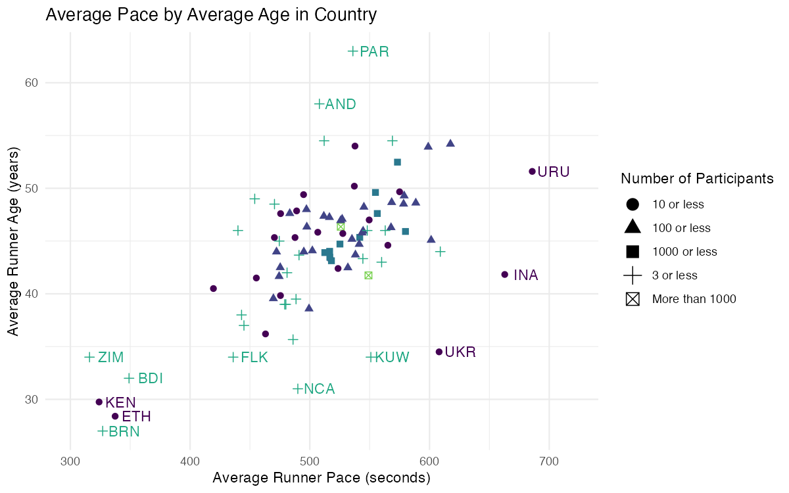
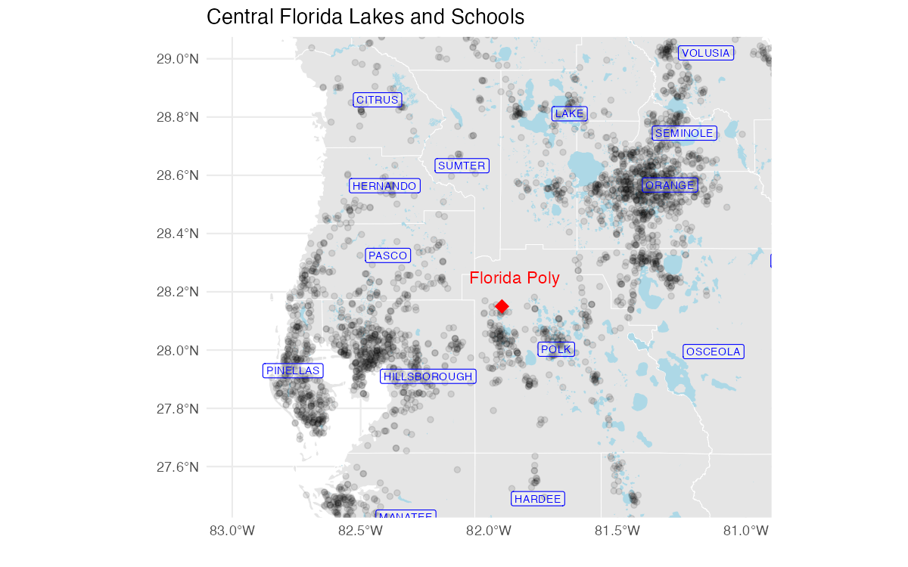
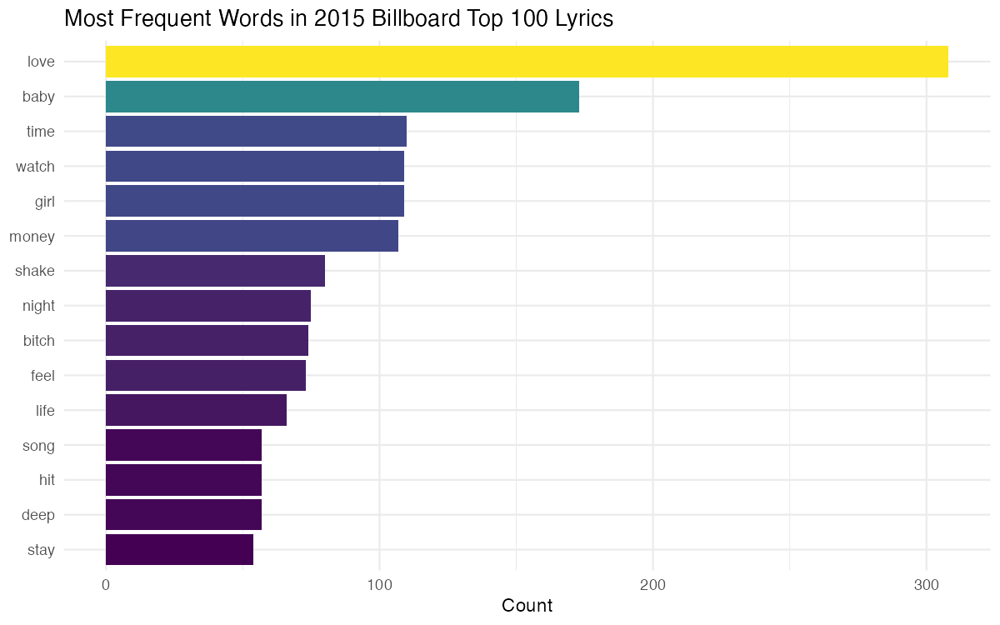

# Data Visualization and Reproducible Research — Final Project

> **Nico Seddio** · CAP 5735 · Florida Polytechnic University

This repository compiles three projects produced during the *Data Visualization
and Reproducible Research* course. Each one applies the principles of effective,
honest, and accessible visualization to a different dataset and a different family
of charts — from distributions and spatial maps to text and modeling.

**NOTE:** interactive charts do not render in the markdown versions.

Jump to:
- [Project 1](#project-01--the-2017-boston-marathon) 
([markdown](project-01/project-01.md), [html](project-01/project-01.html))
- [Project 2](#project-02--florida-lakes-schools--counties) 
([markdown](project-02/project-02.md), [html](project-02/project-02.html))
- [Project 3](#project-03--distributions--text-data) 
([markdown](project-03/project-03.md), [html](project-03/project-03.html))

## Motivation

The goal across all three projects is the same: let the **data tell its own story**
with as little distortion and as much accessibility as possible. To that end, every
report works toward three shared requirements:

- **One interactive chart** (built with `plotly`/`ggplotly`) that lets the reader
  hover for exact values and zoom into dense regions — something a static image
  cannot do.
- **Accessibility** — colorblind-safe `viridis` palettes, `fig.alt` alt text on
  figures, and meaning reinforced by shape, facet, or label rather than color alone.
- **A before/after redesign** of a deliberately bad chart, with an explanation of
  what was wrong and how the fix helps.

See [Shared-requirement coverage](#shared-requirement-coverage) below for where each
of these is addressed.

## The Data

All datasets live in the top-level [`data/`](data/) folder; sources are documented
in [`data/README.md`](data/README.md). Spatial shapefiles are provided unzipped.

| Project | Dataset |
|---|---|
| 01 | 2017 Boston Marathon finishers (`marathon_results_2017.csv`) |
| 02 | Florida counties, lakes, and public/private schools (shapefiles) |
| 03 | TPA airport daily weather, 2022 (`tpa_weather_2022.csv`) |
| 03 | Billboard Top 100 lyrics, 2015 (`BB_top100_2015.csv`) |

---

## Project 01 — The 2017 Boston Marathon

In [`project-01/`](project-01/) 
([markdown](project-01/project-01.md), [html](project-01/project-01.html)) 
I get to know a dataset of Boston Marathon finishers
before plotting anything — confirming what `Bib`, `Division`, and `Country`
actually represent — then explore four angles: 
the distribution of runners across **division-placement numbers**, 
density plotting **runner slowdown in the second half**, 
the **gender makeup** of the most-represented countries, 
and how **average pace relates to average age** at the country level.
This revision includes fixes based on feedback on the original mini-project.

**Favorite visualization:** *Average Pace vs. Average Age by Country* — each country
is a single point, color-coded by how many runners it sent, with only the
statistical outliers labeled. It cleanly separates the small, fast, self-selected
fields (Kenya, Ethiopia) from the broad recreational pack.



## Project 02 — Florida Lakes, Schools & Counties

In [`project-02/`](project-02/) 
([markdown](project-02/project-02.md), [html](project-02/project-02.html)) 
I join three Florida spatial datasets — county
boundaries, lakes, and public/private schools — to ask whether lake area has any
relationship to school enrollment. After reconciling mismatched county names across
the sources, the analysis moves from **interactive enrollment bar charts** to a
**Central Florida map**, a **linear model**, and a **k-means clustering** of
counties. The answer is essentially *no*: enrollment is overwhelmingly public and
population-driven, and the apparent map-level link between schools and lakes
dissolves once modeled.

**Favorite visualization:** *Central Florida Lakes and Schools* — a zoomed map
around Florida Polytechnic University showing the state's dense central cluster of
lakes alongside school locations.



## Project 03 — Distributions & Text Data

In [`project-03/`](project-03/) 
([markdown](project-03/project-03.md), [html](project-03/project-03.html))
I explore two visualization families. First, the
**distribution** of Tampa's daily high temperatures through histograms, density
curves, a faceted density grid, and a ridgeline plot — revealing a striking "summer
compression" where daily highs collapse into a tight band in the low 90s from June
through September. An interactive precipitation chart adds Florida's wet-season
spike. Second, **text data** from 2015 Billboard lyrics, surfacing a pop vocabulary
built on *love*, *time*, and repetition.

**Favorite visualization:** *Most Frequent Words in 2015 Billboard Top 100 Lyrics* — 
a horizontal bar chart of the fifteen most frequent words across 
2015 Billboard Top 100 lyrics after removing stop words.



---

## Shared-requirement coverage

| Requirement | Project 01 | Project 02 | Project 03 |
|---|---|---|---|
| Interactive chart | avg pace age chart | enrollment charts | precipitation chart |
| Colorblind-safe palette | `viridis` | `viridis` | `viridis`, `plasma` |
| `fig.alt` alt text | ✓ all charts | ✓ all charts | ✓ all charts |
| Before/after redesign | _Gender by Country_ log chart | _Enrollment by County_ redesign | _Billboard_ most frequent words data refinement |

## Repository Structure

```
.
├── README.md            # this file — executive summary
├── data/                # all datasets + data/README.md (sources)
├── figures/             # exported favorite-chart images
├── project-01/          # marathon: project-01.Rmd → .html + .md
├── project-02/          # FL spatial: project-02.Rmd → .html + .md (+ interactive widgets)
└── project-03/          # weather + text: project-03.Rmd → .html + .md
```

## Reproducing the Analysis

1. Open `FPU_CAP5735_final_project.Rproj` in RStudio.
2. Install the packages used across the projects:
   ```r
   install.packages(c("tidyverse", "sf", "plotly", "ggridges",
                      "tidytext", "htmlwidgets", "broom"))
   ```
3. Knit each `project-0X/project-0X.Rmd`. Knit to `HTML` to see interactive output,
    knit to `github_document` to see markdown with static charts. These are kept
    separate so that Github / markdown files display images 
    instead of broken interactive chart html.

## AI Use Statement

Claude (Anthropic) assisted with drafting written narrative and this README. All
code, data-wrangling decisions, and visualization choices were made independently
and reviewed for accuracy against the data before inclusion.
