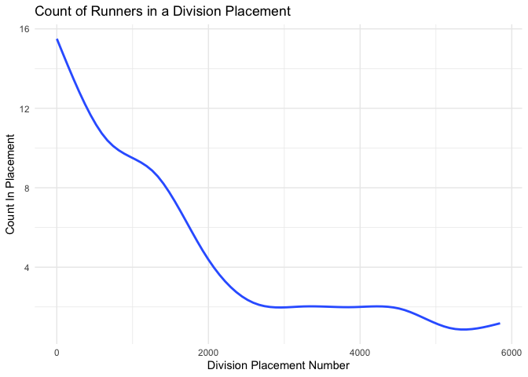
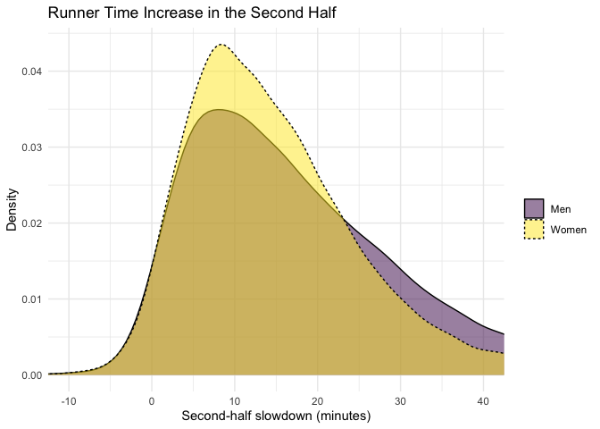
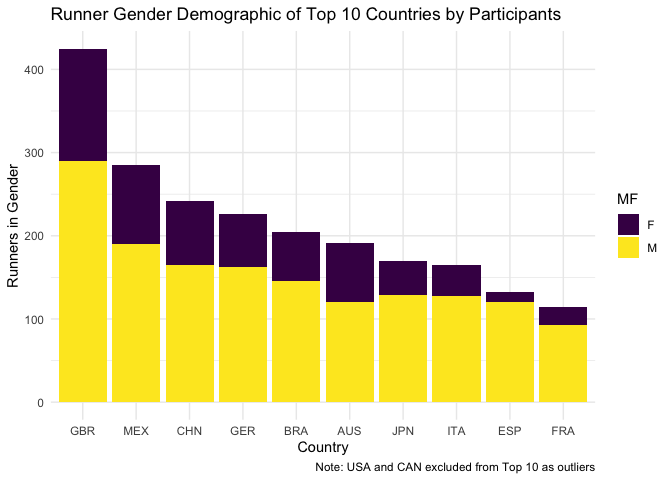
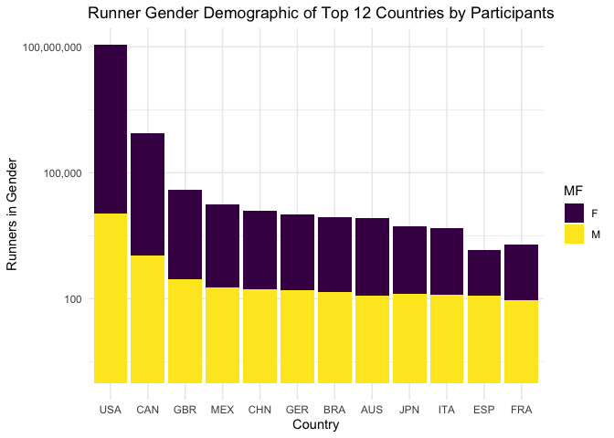

# Setup


``` r
library(tidyverse)
# install.packages("plotly")
library(plotly)
marathon <- read_csv('../data/marathon_results_2017.csv')
```

```
## Warning: One or more parsing issues, call `problems()` on your data frame for details,
## e.g.:
##   dat <- vroom(...)
##   problems(dat)
```

``` r
# Fix column name
marathon <- marathon %>% mutate(MF = `M/F`)
```

Looks like more information can be found [on kaggle](https://www.kaggle.com/datasets/rojour/finishers-boston-marathon-2017):

> This is a list of the finishers of the Boston Marathon of 2017. [...] It contains the name, age, gender, country, city and state (where available), times at 9 different stages of the race, expected time, finish time and pace, overall place, gender place and division place.

# Visualizations

## Count of Runners Within a Division Placement

Even though the Division variable is a placement within the Division rather than 
a Division identifier, we can still look for neat trends on where runners tend 
to score within their division.


``` r
marathon %>% 
  rename(division_placement_number = Division) %>% 
  group_by(division_placement_number) %>% 
  summarise(count_in_placement=n()) %>% 
  ggplot(aes(division_placement_number,count_in_placement)) +
  geom_smooth(se=FALSE) +
  ylab("Count In Placement") +
  xlab("Division Placement Number") +
  labs(title = "Count of Runners in a Division Placement") +
  theme_minimal()
```

```
## `geom_smooth()` using method = 'gam' and formula = 'y ~ s(x, bs = "cs")'
```



## Runner Time Increase in the Second Half

Feedback given to me about the **Count of Runners Within a Division Placement** 
chart above informed me that the chart is based on ranking values and is less 
informative than the other charts in this project.

In an effort to find a more interesting chart, I instead wanted to see how 
runners second half time compared to their first half, whether they sped up or 
slowed down. Using the `Half` and `Official Time` values, I calculated the 
difference between runner first half and second half times and plotted it as a 
density similar to many of the charts in `project-03`. A positive difference 
indicates a slowdown (adding time to the second half over the first half). The 
distribution below shows the majority of runners, both men and women, slowed 
down in the second half of the marathon -- although there were some that sped up 
(negative difference in second half), and these are interesting too.


``` r
marathon %>%
  mutate(
    first_half_sec = as.numeric(Half),
    second_half_sec = as.numeric(`Official Time`) - first_half_sec,
    slowdown_min = (second_half_sec - first_half_sec) / 60
  ) %>%
  filter(!is.na(slowdown_min), MF %in% c("M", "F")) %>%
  mutate(Gender = recode(MF, M = "Men", F = "Women")) %>% 
  ggplot(aes(slowdown_min, fill = Gender, linetype = Gender)) +
  geom_density(alpha = 0.5) +
  scale_fill_viridis_d() +
  coord_cartesian(xlim = c(-10, 40)) +
  labs(
    title = "Runner Time Increase in the Second Half",
    x = "Second-half slowdown (minutes)",
    y = "Density", fill = "", linetype = ""
  ) +
  theme_minimal()
```



## Runner Gender Demographic of Top 10 Countries by Participants


``` r
marathon %>% 
  inner_join(marathon %>% 
    group_by(Country) %>% 
    summarise(runner_count=n()) %>% 
    # USA and CAN are pretty big outliers, let's remove them
    filter(!(Country %in% c("USA","CAN"))) %>% 
    arrange(desc(runner_count))  %>% 
    top_n(10), 
    by = join_by(Country)) %>% 
  ggplot(aes(x=fct_infreq(Country),fill = MF)) +
  geom_bar() +
  scale_fill_viridis_d() +
  theme_minimal() +
  labs(
    title = "Runner Gender Demographic of Top 10 Countries by Participants",
    caption = "Note: USA and CAN excluded from Top 10 as outliers",
    x = "Country",
    y = "Runners in Gender")
```



## Redesigning a Bad Chart (_After_/Before)

Using a continuous scale is important in the stacked bar chart above. 
The chart below is an example of this chart done badly: using a logarithmic scale 
for the y-axis results in demographic splits that look too close to normal. If we
wanted to create a chart that included USA and CAN like this one, it might be 
better to create a similar chart with only the total runners on the logarithmic 
scale, and then explore male-female demographics of countries on something like 
a density chart instead.


``` r
marathon %>% 
  inner_join(marathon %>% 
    group_by(Country) %>% 
    summarise(runner_count=n()) %>% 
    arrange(desc(runner_count))  %>% 
    top_n(12), 
    by = join_by(Country)) %>% 
  ggplot(aes(x=fct_infreq(Country),fill = MF)) +
  geom_bar() +
  scale_fill_viridis_d() +
  scale_y_log10(label = scales::comma) +
  theme_minimal() +
  labs(
    title = "Runner Gender Demographic of Top 12 Countries by Participants",
    x = "Country",
    y = "Runners in Gender")
```



## Average Pace by Average Age in Country

Scatter plot of countries by average finisher pace and average age, point shape 
and color showing participant count. This chart initially had only color encoding
the number of participants; shape was added as the primary identifier instead 
with color acting as a helpful differentiation. The interactivity of this plot
allows users to hover over individual points even with visually cluttering labels
to see exactly which country and values the point represents.


``` r
avg_pace_age_country_scatter <- marathon %>% 
  group_by(Country) %>% 
  summarise(
    avg_pace = mean(Pace), 
    avg_age = mean(Age), 
    part_count=n()) %>% 
  mutate(part_cat = case_when(
    part_count <= 3 ~ "3 or less",
    part_count <= 10 ~ "10 or less",
    part_count <= 100 ~ "100 or less",
    part_count <= 1000 ~ "1000 or less",
    .default = "More than 1000")) %>% 
  ggplot(aes(
    avg_pace,
    avg_age,
    color = part_cat,
    shape = part_cat,
    label = Country)) +
  geom_point(size = 2) +
  geom_text(
    aes(label = ifelse(
      avg_pace < 400 | 
      avg_age > 55 | 
      avg_age < 35 | 
      avg_pace > 650, 
      Country,""),x=avg_pace+18), 
    show.legend = FALSE) +
  xlim(c(300,720)) +
  labs(
    title = "Average Pace by Average Age in Country",
    shape = "Number of Participants",
    x = "Average Runner Pace (seconds)",
    y = "Average Runner Age (years)") +
  guides(
    shape = guide_legend(override.aes = list(size = 4)),
    color = "none") +
  scale_color_viridis_d(end = 0.8) +
  theme_minimal()
#avg_pace_age_country_scatter
ggsave("../figures/project-01-marathon-pace-age.png", width = 8, height = 5, dpi = 150)
ggplotly(avg_pace_age_country_scatter)
```

```{=html}
<div class="plotly html-widget html-fill-item" id="htmlwidget-e0c3d4fc7c5f3ad864e8" style="width:672px;height:480px;"></div>
<script type="application/json" data-for="htmlwidget-e0c3d4fc7c5f3ad864e8">{"x":{"data":[{"x":[537.75,475.5,537.20000000000005,487.66666666666669,517.5,506.66666666666669,470.44444444444446,337.39999999999998,475.60000000000002,662.83333333333337,494.80000000000001,324,463,419.5,565.20000000000005,489,575,549.60000000000002,523.60000000000002,527.57142857142856,608,685.79999999999995,455.33333333333331],"y":[54,39.833333333333336,50.200000000000003,45.333333333333336,43.25,45.833333333333336,45.333333333333336,28.399999999999999,47.600000000000001,41.833333333333336,49.399999999999999,29.75,36.200000000000003,40.5,44.600000000000001,47.857142857142854,49.666666666666664,47,42.399999999999999,45.714285714285715,34.5,51.600000000000001,41.5],"text":["avg_pace: 537.7500 secs<br />avg_age: 54.00000<br />part_cat: 10 or less<br />part_cat: 10 or less<br />Country: BAR","avg_pace: 475.5000 secs<br />avg_age: 39.83333<br />part_cat: 10 or less<br />part_cat: 10 or less<br />Country: CAY","avg_pace: 537.2000 secs<br />avg_age: 50.20000<br />part_cat: 10 or less<br />part_cat: 10 or less<br />Country: CRO","avg_pace: 487.6667 secs<br />avg_age: 45.33333<br />part_cat: 10 or less<br />part_cat: 10 or less<br />Country: DOM","avg_pace: 517.5000 secs<br />avg_age: 43.25000<br />part_cat: 10 or less<br />part_cat: 10 or less<br />Country: ECU","avg_pace: 506.6667 secs<br />avg_age: 45.83333<br />part_cat: 10 or less<br />part_cat: 10 or less<br />Country: ESA","avg_pace: 470.4444 secs<br />avg_age: 45.33333<br />part_cat: 10 or less<br />part_cat: 10 or less<br />Country: EST","avg_pace: 337.4000 secs<br />avg_age: 28.40000<br />part_cat: 10 or less<br />part_cat: 10 or less<br />Country: ETH","avg_pace: 475.6000 secs<br />avg_age: 47.60000<br />part_cat: 10 or less<br />part_cat: 10 or less<br />Country: GRE","avg_pace: 662.8333 secs<br />avg_age: 41.83333<br />part_cat: 10 or less<br />part_cat: 10 or less<br />Country: INA","avg_pace: 494.8000 secs<br />avg_age: 49.40000<br />part_cat: 10 or less<br />part_cat: 10 or less<br />Country: ISR","avg_pace: 324.0000 secs<br />avg_age: 29.75000<br />part_cat: 10 or less<br />part_cat: 10 or less<br />Country: KEN","avg_pace: 463.0000 secs<br />avg_age: 36.20000<br />part_cat: 10 or less<br />part_cat: 10 or less<br />Country: LTU","avg_pace: 419.5000 secs<br />avg_age: 40.50000<br />part_cat: 10 or less<br />part_cat: 10 or less<br />Country: PAN","avg_pace: 565.2000 secs<br />avg_age: 44.60000<br />part_cat: 10 or less<br />part_cat: 10 or less<br />Country: PHI","avg_pace: 489.0000 secs<br />avg_age: 47.85714<br />part_cat: 10 or less<br />part_cat: 10 or less<br />Country: SLO","avg_pace: 575.0000 secs<br />avg_age: 49.66667<br />part_cat: 10 or less<br />part_cat: 10 or less<br />Country: SVK","avg_pace: 549.6000 secs<br />avg_age: 47.00000<br />part_cat: 10 or less<br />part_cat: 10 or less<br />Country: THA","avg_pace: 523.6000 secs<br />avg_age: 42.40000<br />part_cat: 10 or less<br />part_cat: 10 or less<br />Country: TUR","avg_pace: 527.5714 secs<br />avg_age: 45.71429<br />part_cat: 10 or less<br />part_cat: 10 or less<br />Country: UAE","avg_pace: 608.0000 secs<br />avg_age: 34.50000<br />part_cat: 10 or less<br />part_cat: 10 or less<br />Country: UKR","avg_pace: 685.8000 secs<br />avg_age: 51.60000<br />part_cat: 10 or less<br />part_cat: 10 or less<br />Country: URU","avg_pace: 455.3333 secs<br />avg_age: 41.50000<br />part_cat: 10 or less<br />part_cat: 10 or less<br />Country: VEN"],"type":"scatter","mode":"markers","marker":{"autocolorscale":false,"color":"rgba(68,1,84,1)","opacity":1,"size":7.559055118110237,"symbol":"circle","line":{"width":1.8897637795275593,"color":"rgba(68,1,84,1)"}},"hoveron":"points","name":"10 or less","legendgroup":"10 or less","showlegend":true,"xaxis":"x","yaxis":"y","hoverinfo":"text","frame":null},{"x":[516.38888888888891,545.18181818181813,567.85714285714289,495,472.19672131147547,469.58730158730151,511.72727272727275,535.2166666666667,497.19999999999999,475.29166666666663,543.67346938775495,568.38888888888891,531.79310344827582,578.33333333333337,617.47727272727263,598.91666666666663,601.36363636363637,541.25641025641039,525.79069767441865,588.52941176470586,474.375,497.5,483.25,578.82352941176475,499.34482758620686,538.10000000000002,544.5670103092782,527.04918032786895,502.12962962962968],"y":[47.25,48.227272727272727,46.285714285714285,43.986301369863014,43.983606557377051,39.555555555555564,47.363636363636367,45.18333333333333,48,42.5,45.785714285714292,48.666666666666664,42.482758620689658,48.518518518518519,54.19318181818182,53.916666666666664,45.090909090909093,44.705128205128204,46.95348837209302,48.617647058823529,41.65625,46.34375,47.625,49.294117647058826,38.586206896551722,43.700000000000003,45.948453608247426,47.081967213114751,44.092592592592588],"text":["avg_pace: 516.3889 secs<br />avg_age: 47.25000<br />part_cat: 100 or less<br />part_cat: 100 or less<br />Country: ARG","avg_pace: 545.1818 secs<br />avg_age: 48.22727<br />part_cat: 100 or less<br />part_cat: 100 or less<br />Country: AUT","avg_pace: 567.8571 secs<br />avg_age: 46.28571<br />part_cat: 100 or less<br />part_cat: 100 or less<br />Country: BEL","avg_pace: 495.0000 secs<br />avg_age: 43.98630<br />part_cat: 100 or less<br />part_cat: 100 or less<br />Country: CHI","avg_pace: 472.1967 secs<br />avg_age: 43.98361<br />part_cat: 100 or less<br />part_cat: 100 or less<br />Country: COL","avg_pace: 469.5873 secs<br />avg_age: 39.55556<br />part_cat: 100 or less<br />part_cat: 100 or less<br />Country: CRC","avg_pace: 511.7273 secs<br />avg_age: 47.36364<br />part_cat: 100 or less<br />part_cat: 100 or less<br />Country: CZE","avg_pace: 535.2167 secs<br />avg_age: 45.18333<br />part_cat: 100 or less<br />part_cat: 100 or less<br />Country: DEN","avg_pace: 497.2000 secs<br />avg_age: 48.00000<br />part_cat: 100 or less<br />part_cat: 100 or less<br />Country: FIN","avg_pace: 475.2917 secs<br />avg_age: 42.50000<br />part_cat: 100 or less<br />part_cat: 100 or less<br />Country: GUA","avg_pace: 543.6735 secs<br />avg_age: 45.78571<br />part_cat: 100 or less<br />part_cat: 100 or less<br />Country: HKG","avg_pace: 568.3889 secs<br />avg_age: 48.66667<br />part_cat: 100 or less<br />part_cat: 100 or less<br />Country: IND","avg_pace: 531.7931 secs<br />avg_age: 42.48276<br />part_cat: 100 or less<br />part_cat: 100 or less<br />Country: IRL","avg_pace: 578.3333 secs<br />avg_age: 48.51852<br />part_cat: 100 or less<br />part_cat: 100 or less<br />Country: ISL","avg_pace: 617.4773 secs<br />avg_age: 54.19318<br />part_cat: 100 or less<br />part_cat: 100 or less<br />Country: KOR","avg_pace: 598.9167 secs<br />avg_age: 53.91667<br />part_cat: 100 or less<br />part_cat: 100 or less<br />Country: MAR","avg_pace: 601.3636 secs<br />avg_age: 45.09091<br />part_cat: 100 or less<br />part_cat: 100 or less<br />Country: MAS","avg_pace: 541.2564 secs<br />avg_age: 44.70513<br />part_cat: 100 or less<br />part_cat: 100 or less<br />Country: NED","avg_pace: 525.7907 secs<br />avg_age: 46.95349<br />part_cat: 100 or less<br />part_cat: 100 or less<br />Country: NOR","avg_pace: 588.5294 secs<br />avg_age: 48.61765<br />part_cat: 100 or less<br />part_cat: 100 or less<br />Country: NZL","avg_pace: 474.3750 secs<br />avg_age: 41.65625<br />part_cat: 100 or less<br />part_cat: 100 or less<br />Country: PER","avg_pace: 497.5000 secs<br />avg_age: 46.34375<br />part_cat: 100 or less<br />part_cat: 100 or less<br />Country: POL","avg_pace: 483.2500 secs<br />avg_age: 47.62500<br />part_cat: 100 or less<br />part_cat: 100 or less<br />Country: POR","avg_pace: 578.8235 secs<br />avg_age: 49.29412<br />part_cat: 100 or less<br />part_cat: 100 or less<br />Country: RSA","avg_pace: 499.3448 secs<br />avg_age: 38.58621<br />part_cat: 100 or less<br />part_cat: 100 or less<br />Country: RUS","avg_pace: 538.1000 secs<br />avg_age: 43.70000<br />part_cat: 100 or less<br />part_cat: 100 or less<br />Country: SIN","avg_pace: 544.5670 secs<br />avg_age: 45.94845<br />part_cat: 100 or less<br />part_cat: 100 or less<br />Country: SUI","avg_pace: 527.0492 secs<br />avg_age: 47.08197<br />part_cat: 100 or less<br />part_cat: 100 or less<br />Country: SWE","avg_pace: 502.1296 secs<br />avg_age: 44.09259<br />part_cat: 100 or less<br />part_cat: 100 or less<br />Country: TWN"],"type":"scatter","mode":"markers","marker":{"autocolorscale":false,"color":"rgba(65,68,135,1)","opacity":1,"size":7.559055118110237,"symbol":"triangle-up","line":{"width":1.8897637795275593,"color":"rgba(65,68,135,1)"}},"hoveron":"points","name":"100 or less","legendgroup":"100 or less","showlegend":true,"xaxis":"x","yaxis":"y","hoverinfo":"text","frame":null},{"x":[525.17277486910984,512.526829268293,579.92148760330588,541.719696969697,516.57017543859661,518.07058823529428,556.37610619469058,554.84848484848476,573.2352941176473,516.74385964912267],"y":[44.717277486910987,43.907317073170738,45.909090909090907,45.348484848484851,44.026315789473678,43.134117647058829,47.610619469026531,49.606060606060595,52.47647058823528,43.459649122807008],"text":["avg_pace: 525.1728 secs<br />avg_age: 44.71728<br />part_cat: 1000 or less<br />part_cat: 1000 or less<br />Country: AUS","avg_pace: 512.5268 secs<br />avg_age: 43.90732<br />part_cat: 1000 or less<br />part_cat: 1000 or less<br />Country: BRA","avg_pace: 579.9215 secs<br />avg_age: 45.90909<br />part_cat: 1000 or less<br />part_cat: 1000 or less<br />Country: CHN","avg_pace: 541.7197 secs<br />avg_age: 45.34848<br />part_cat: 1000 or less<br />part_cat: 1000 or less<br />Country: ESP","avg_pace: 516.5702 secs<br />avg_age: 44.02632<br />part_cat: 1000 or less<br />part_cat: 1000 or less<br />Country: FRA","avg_pace: 518.0706 secs<br />avg_age: 43.13412<br />part_cat: 1000 or less<br />part_cat: 1000 or less<br />Country: GBR","avg_pace: 556.3761 secs<br />avg_age: 47.61062<br />part_cat: 1000 or less<br />part_cat: 1000 or less<br />Country: GER","avg_pace: 554.8485 secs<br />avg_age: 49.60606<br />part_cat: 1000 or less<br />part_cat: 1000 or less<br />Country: ITA","avg_pace: 573.2353 secs<br />avg_age: 52.47647<br />part_cat: 1000 or less<br />part_cat: 1000 or less<br />Country: JPN","avg_pace: 516.7439 secs<br />avg_age: 43.45965<br />part_cat: 1000 or less<br />part_cat: 1000 or less<br />Country: MEX"],"type":"scatter","mode":"markers","marker":{"autocolorscale":false,"color":"rgba(42,120,142,1)","opacity":1,"size":7.559055118110237,"symbol":"square","line":{"width":1.8897637795275593,"color":"rgba(42,120,142,1)"}},"hoveron":"points","name":"1000 or less","legendgroup":"1000 or less","showlegend":true,"xaxis":"x","yaxis":"y","hoverinfo":"text","frame":null},{"x":[512,508,349,491,327,481,488.5,436,569,480,544.33333333333337,440,454,551,486,470.5,563,445,490,609,536,474.5,479,443,548,560,316],"y":[54.5,58,32,43.666666666666664,27,42,39.5,34,54.5,39,43.333333333333336,46,49,34,35.666666666666664,48.5,46,37,31,44,63,45,39,38,46,43,34],"text":["avg_pace: 512.0000 secs<br />avg_age: 54.50000<br />part_cat: 3 or less<br />part_cat: 3 or less<br />Country: ALG","avg_pace: 508.0000 secs<br />avg_age: 58.00000<br />part_cat: 3 or less<br />part_cat: 3 or less<br />Country: AND","avg_pace: 349.0000 secs<br />avg_age: 32.00000<br />part_cat: 3 or less<br />part_cat: 3 or less<br />Country: BDI","avg_pace: 491.0000 secs<br />avg_age: 43.66667<br />part_cat: 3 or less<br />part_cat: 3 or less<br />Country: BER","avg_pace: 327.0000 secs<br />avg_age: 27.00000<br />part_cat: 3 or less<br />part_cat: 3 or less<br />Country: BRN","avg_pace: 481.0000 secs<br />avg_age: 42.00000<br />part_cat: 3 or less<br />part_cat: 3 or less<br />Country: BUL","avg_pace: 488.5000 secs<br />avg_age: 39.50000<br />part_cat: 3 or less<br />part_cat: 3 or less<br />Country: EGY","avg_pace: 436.0000 secs<br />avg_age: 34.00000<br />part_cat: 3 or less<br />part_cat: 3 or less<br />Country: FLK","avg_pace: 569.0000 secs<br />avg_age: 54.50000<br />part_cat: 3 or less<br />part_cat: 3 or less<br />Country: GRN","avg_pace: 480.0000 secs<br />avg_age: 39.00000<br />part_cat: 3 or less<br />part_cat: 3 or less<br />Country: HON","avg_pace: 544.3333 secs<br />avg_age: 43.33333<br />part_cat: 3 or less<br />part_cat: 3 or less<br />Country: HUN","avg_pace: 440.0000 secs<br />avg_age: 46.00000<br />part_cat: 3 or less<br />part_cat: 3 or less<br />Country: JAM","avg_pace: 454.0000 secs<br />avg_age: 49.00000<br />part_cat: 3 or less<br />part_cat: 3 or less<br />Country: KSA","avg_pace: 551.0000 secs<br />avg_age: 34.00000<br />part_cat: 3 or less<br />part_cat: 3 or less<br />Country: KUW","avg_pace: 486.0000 secs<br />avg_age: 35.66667<br />part_cat: 3 or less<br />part_cat: 3 or less<br />Country: LAT","avg_pace: 470.5000 secs<br />avg_age: 48.50000<br />part_cat: 3 or less<br />part_cat: 3 or less<br />Country: LUX","avg_pace: 563.0000 secs<br />avg_age: 46.00000<br />part_cat: 3 or less<br />part_cat: 3 or less<br />Country: MGL","avg_pace: 445.0000 secs<br />avg_age: 37.00000<br />part_cat: 3 or less<br />part_cat: 3 or less<br />Country: MLT","avg_pace: 490.0000 secs<br />avg_age: 31.00000<br />part_cat: 3 or less<br />part_cat: 3 or less<br />Country: NCA","avg_pace: 609.0000 secs<br />avg_age: 44.00000<br />part_cat: 3 or less<br />part_cat: 3 or less<br />Country: NGR","avg_pace: 536.0000 secs<br />avg_age: 63.00000<br />part_cat: 3 or less<br />part_cat: 3 or less<br />Country: PAR","avg_pace: 474.5000 secs<br />avg_age: 45.00000<br />part_cat: 3 or less<br />part_cat: 3 or less<br />Country: ROU","avg_pace: 479.0000 secs<br />avg_age: 39.00000<br />part_cat: 3 or less<br />part_cat: 3 or less<br />Country: SMR","avg_pace: 443.0000 secs<br />avg_age: 38.00000<br />part_cat: 3 or less<br />part_cat: 3 or less<br />Country: SRB","avg_pace: 548.0000 secs<br />avg_age: 46.00000<br />part_cat: 3 or less<br />part_cat: 3 or less<br />Country: TCA","avg_pace: 560.0000 secs<br />avg_age: 43.00000<br />part_cat: 3 or less<br />part_cat: 3 or less<br />Country: TRI","avg_pace: 316.0000 secs<br />avg_age: 34.00000<br />part_cat: 3 or less<br />part_cat: 3 or less<br />Country: ZIM"],"type":"scatter","mode":"markers","marker":{"autocolorscale":false,"color":"rgba(34,168,132,1)","opacity":1,"size":7.559055118110237,"symbol":"cross-thin-open","line":{"width":1.8897637795275593,"color":"rgba(34,168,132,1)"}},"hoveron":"points","name":"3 or less","legendgroup":"3 or less","showlegend":true,"xaxis":"x","yaxis":"y","hoverinfo":"text","frame":null},{"x":[525.87807486630913,549.02253521124885],"y":[46.358823529411694,41.74843638099869],"text":["avg_pace: 525.8781 secs<br />avg_age: 46.35882<br />part_cat: More than 1000<br />part_cat: More than 1000<br />Country: CAN","avg_pace: 549.0225 secs<br />avg_age: 41.74844<br />part_cat: More than 1000<br />part_cat: More than 1000<br />Country: USA"],"type":"scatter","mode":"markers","marker":{"autocolorscale":false,"color":"rgba(122,209,81,1)","opacity":1,"size":7.559055118110237,"symbol":"square-x-open","line":{"width":1.8897637795275593,"color":"rgba(122,209,81,1)"}},"hoveron":"points","name":"More than 1000","legendgroup":"More than 1000","showlegend":true,"xaxis":"x","yaxis":"y","hoverinfo":"text","frame":null},{"x":[555.75,493.5,555.20000000000005,505.66666666666669,535.5,524.66666666666674,488.44444444444446,355.39999999999998,493.60000000000002,680.83333333333337,512.79999999999995,342,481,437.5,583.20000000000005,507,593,567.60000000000002,541.60000000000002,545.57142857142856,626,703.79999999999995,473.33333333333331],"y":[54,39.833333333333336,50.200000000000003,45.333333333333336,43.25,45.833333333333336,45.333333333333336,28.399999999999999,47.600000000000001,41.833333333333336,49.399999999999999,29.75,36.200000000000003,40.5,44.600000000000001,47.857142857142854,49.666666666666664,47,42.399999999999999,45.714285714285715,34.5,51.600000000000001,41.5],"text":["","","","","","","","ETH","","INA","","KEN","","","","","","","","","UKR","URU",""],"hovertext":["avg_pace + 18: 555.7500 secs<br />avg_age: 54.00000<br />part_cat: 10 or less<br />part_cat: 10 or less<br />ifelse(avg_pace < 400 | avg_age > 55 | avg_age < 35 | avg_pace > ...: ","avg_pace + 18: 493.5000 secs<br />avg_age: 39.83333<br />part_cat: 10 or less<br />part_cat: 10 or less<br />ifelse(avg_pace < 400 | avg_age > 55 | avg_age < 35 | avg_pace > ...: ","avg_pace + 18: 555.2000 secs<br />avg_age: 50.20000<br />part_cat: 10 or less<br />part_cat: 10 or less<br />ifelse(avg_pace < 400 | avg_age > 55 | avg_age < 35 | avg_pace > ...: ","avg_pace + 18: 505.6667 secs<br />avg_age: 45.33333<br />part_cat: 10 or less<br />part_cat: 10 or less<br />ifelse(avg_pace < 400 | avg_age > 55 | avg_age < 35 | avg_pace > ...: ","avg_pace + 18: 535.5000 secs<br />avg_age: 43.25000<br />part_cat: 10 or less<br />part_cat: 10 or less<br />ifelse(avg_pace < 400 | avg_age > 55 | avg_age < 35 | avg_pace > ...: ","avg_pace + 18: 524.6667 secs<br />avg_age: 45.83333<br />part_cat: 10 or less<br />part_cat: 10 or less<br />ifelse(avg_pace < 400 | avg_age > 55 | avg_age < 35 | avg_pace > ...: ","avg_pace + 18: 488.4444 secs<br />avg_age: 45.33333<br />part_cat: 10 or less<br />part_cat: 10 or less<br />ifelse(avg_pace < 400 | avg_age > 55 | avg_age < 35 | avg_pace > ...: ","avg_pace + 18: 355.4000 secs<br />avg_age: 28.40000<br />part_cat: 10 or less<br />part_cat: 10 or less<br />ifelse(avg_pace < 400 | avg_age > 55 | avg_age < 35 | avg_pace > ...: ETH","avg_pace + 18: 493.6000 secs<br />avg_age: 47.60000<br />part_cat: 10 or less<br />part_cat: 10 or less<br />ifelse(avg_pace < 400 | avg_age > 55 | avg_age < 35 | avg_pace > ...: ","avg_pace + 18: 680.8333 secs<br />avg_age: 41.83333<br />part_cat: 10 or less<br />part_cat: 10 or less<br />ifelse(avg_pace < 400 | avg_age > 55 | avg_age < 35 | avg_pace > ...: INA","avg_pace + 18: 512.8000 secs<br />avg_age: 49.40000<br />part_cat: 10 or less<br />part_cat: 10 or less<br />ifelse(avg_pace < 400 | avg_age > 55 | avg_age < 35 | avg_pace > ...: ","avg_pace + 18: 342.0000 secs<br />avg_age: 29.75000<br />part_cat: 10 or less<br />part_cat: 10 or less<br />ifelse(avg_pace < 400 | avg_age > 55 | avg_age < 35 | avg_pace > ...: KEN","avg_pace + 18: 481.0000 secs<br />avg_age: 36.20000<br />part_cat: 10 or less<br />part_cat: 10 or less<br />ifelse(avg_pace < 400 | avg_age > 55 | avg_age < 35 | avg_pace > ...: ","avg_pace + 18: 437.5000 secs<br />avg_age: 40.50000<br />part_cat: 10 or less<br />part_cat: 10 or less<br />ifelse(avg_pace < 400 | avg_age > 55 | avg_age < 35 | avg_pace > ...: ","avg_pace + 18: 583.2000 secs<br />avg_age: 44.60000<br />part_cat: 10 or less<br />part_cat: 10 or less<br />ifelse(avg_pace < 400 | avg_age > 55 | avg_age < 35 | avg_pace > ...: ","avg_pace + 18: 507.0000 secs<br />avg_age: 47.85714<br />part_cat: 10 or less<br />part_cat: 10 or less<br />ifelse(avg_pace < 400 | avg_age > 55 | avg_age < 35 | avg_pace > ...: ","avg_pace + 18: 593.0000 secs<br />avg_age: 49.66667<br />part_cat: 10 or less<br />part_cat: 10 or less<br />ifelse(avg_pace < 400 | avg_age > 55 | avg_age < 35 | avg_pace > ...: ","avg_pace + 18: 567.6000 secs<br />avg_age: 47.00000<br />part_cat: 10 or less<br />part_cat: 10 or less<br />ifelse(avg_pace < 400 | avg_age > 55 | avg_age < 35 | avg_pace > ...: ","avg_pace + 18: 541.6000 secs<br />avg_age: 42.40000<br />part_cat: 10 or less<br />part_cat: 10 or less<br />ifelse(avg_pace < 400 | avg_age > 55 | avg_age < 35 | avg_pace > ...: ","avg_pace + 18: 545.5714 secs<br />avg_age: 45.71429<br />part_cat: 10 or less<br />part_cat: 10 or less<br />ifelse(avg_pace < 400 | avg_age > 55 | avg_age < 35 | avg_pace > ...: ","avg_pace + 18: 626.0000 secs<br />avg_age: 34.50000<br />part_cat: 10 or less<br />part_cat: 10 or less<br />ifelse(avg_pace < 400 | avg_age > 55 | avg_age < 35 | avg_pace > ...: UKR","avg_pace + 18: 703.8000 secs<br />avg_age: 51.60000<br />part_cat: 10 or less<br />part_cat: 10 or less<br />ifelse(avg_pace < 400 | avg_age > 55 | avg_age < 35 | avg_pace > ...: URU","avg_pace + 18: 473.3333 secs<br />avg_age: 41.50000<br />part_cat: 10 or less<br />part_cat: 10 or less<br />ifelse(avg_pace < 400 | avg_age > 55 | avg_age < 35 | avg_pace > ...: "],"textfont":{"size":14.611872146118722,"color":"rgba(68,1,84,1)"},"type":"scatter","mode":"text","hoveron":"points","name":"10 or less","legendgroup":"10 or less","showlegend":false,"xaxis":"x","yaxis":"y","hoverinfo":"text","frame":null},{"x":[534.38888888888891,563.18181818181813,585.85714285714289,513,490.19672131147547,487.58730158730151,529.72727272727275,553.2166666666667,515.20000000000005,493.29166666666663,561.67346938775495,586.38888888888891,549.79310344827582,596.33333333333337,635.47727272727263,616.91666666666663,619.36363636363637,559.25641025641039,543.79069767441865,606.52941176470586,492.375,515.5,501.25,596.82352941176475,517.34482758620686,556.10000000000002,562.5670103092782,545.04918032786895,520.12962962962968],"y":[47.25,48.227272727272727,46.285714285714285,43.986301369863014,43.983606557377051,39.555555555555564,47.363636363636367,45.18333333333333,48,42.5,45.785714285714292,48.666666666666664,42.482758620689658,48.518518518518519,54.19318181818182,53.916666666666664,45.090909090909093,44.705128205128204,46.95348837209302,48.617647058823529,41.65625,46.34375,47.625,49.294117647058826,38.586206896551722,43.700000000000003,45.948453608247426,47.081967213114751,44.092592592592588],"text":["","","","","","","","","","","","","","","","","","","","","","","","","","","","",""],"hovertext":["avg_pace + 18: 534.3889 secs<br />avg_age: 47.25000<br />part_cat: 100 or less<br />part_cat: 100 or less<br />ifelse(avg_pace < 400 | avg_age > 55 | avg_age < 35 | avg_pace > ...: ","avg_pace + 18: 563.1818 secs<br />avg_age: 48.22727<br />part_cat: 100 or less<br />part_cat: 100 or less<br />ifelse(avg_pace < 400 | avg_age > 55 | avg_age < 35 | avg_pace > ...: ","avg_pace + 18: 585.8571 secs<br />avg_age: 46.28571<br />part_cat: 100 or less<br />part_cat: 100 or less<br />ifelse(avg_pace < 400 | avg_age > 55 | avg_age < 35 | avg_pace > ...: ","avg_pace + 18: 513.0000 secs<br />avg_age: 43.98630<br />part_cat: 100 or less<br />part_cat: 100 or less<br />ifelse(avg_pace < 400 | avg_age > 55 | avg_age < 35 | avg_pace > ...: ","avg_pace + 18: 490.1967 secs<br />avg_age: 43.98361<br />part_cat: 100 or less<br />part_cat: 100 or less<br />ifelse(avg_pace < 400 | avg_age > 55 | avg_age < 35 | avg_pace > ...: ","avg_pace + 18: 487.5873 secs<br />avg_age: 39.55556<br />part_cat: 100 or less<br />part_cat: 100 or less<br />ifelse(avg_pace < 400 | avg_age > 55 | avg_age < 35 | avg_pace > ...: ","avg_pace + 18: 529.7273 secs<br />avg_age: 47.36364<br />part_cat: 100 or less<br />part_cat: 100 or less<br />ifelse(avg_pace < 400 | avg_age > 55 | avg_age < 35 | avg_pace > ...: ","avg_pace + 18: 553.2167 secs<br />avg_age: 45.18333<br />part_cat: 100 or less<br />part_cat: 100 or less<br />ifelse(avg_pace < 400 | avg_age > 55 | avg_age < 35 | avg_pace > ...: ","avg_pace + 18: 515.2000 secs<br />avg_age: 48.00000<br />part_cat: 100 or less<br />part_cat: 100 or less<br />ifelse(avg_pace < 400 | avg_age > 55 | avg_age < 35 | avg_pace > ...: ","avg_pace + 18: 493.2917 secs<br />avg_age: 42.50000<br />part_cat: 100 or less<br />part_cat: 100 or less<br />ifelse(avg_pace < 400 | avg_age > 55 | avg_age < 35 | avg_pace > ...: ","avg_pace + 18: 561.6735 secs<br />avg_age: 45.78571<br />part_cat: 100 or less<br />part_cat: 100 or less<br />ifelse(avg_pace < 400 | avg_age > 55 | avg_age < 35 | avg_pace > ...: ","avg_pace + 18: 586.3889 secs<br />avg_age: 48.66667<br />part_cat: 100 or less<br />part_cat: 100 or less<br />ifelse(avg_pace < 400 | avg_age > 55 | avg_age < 35 | avg_pace > ...: ","avg_pace + 18: 549.7931 secs<br />avg_age: 42.48276<br />part_cat: 100 or less<br />part_cat: 100 or less<br />ifelse(avg_pace < 400 | avg_age > 55 | avg_age < 35 | avg_pace > ...: ","avg_pace + 18: 596.3333 secs<br />avg_age: 48.51852<br />part_cat: 100 or less<br />part_cat: 100 or less<br />ifelse(avg_pace < 400 | avg_age > 55 | avg_age < 35 | avg_pace > ...: ","avg_pace + 18: 635.4773 secs<br />avg_age: 54.19318<br />part_cat: 100 or less<br />part_cat: 100 or less<br />ifelse(avg_pace < 400 | avg_age > 55 | avg_age < 35 | avg_pace > ...: ","avg_pace + 18: 616.9167 secs<br />avg_age: 53.91667<br />part_cat: 100 or less<br />part_cat: 100 or less<br />ifelse(avg_pace < 400 | avg_age > 55 | avg_age < 35 | avg_pace > ...: ","avg_pace + 18: 619.3636 secs<br />avg_age: 45.09091<br />part_cat: 100 or less<br />part_cat: 100 or less<br />ifelse(avg_pace < 400 | avg_age > 55 | avg_age < 35 | avg_pace > ...: ","avg_pace + 18: 559.2564 secs<br />avg_age: 44.70513<br />part_cat: 100 or less<br />part_cat: 100 or less<br />ifelse(avg_pace < 400 | avg_age > 55 | avg_age < 35 | avg_pace > ...: ","avg_pace + 18: 543.7907 secs<br />avg_age: 46.95349<br />part_cat: 100 or less<br />part_cat: 100 or less<br />ifelse(avg_pace < 400 | avg_age > 55 | avg_age < 35 | avg_pace > ...: ","avg_pace + 18: 606.5294 secs<br />avg_age: 48.61765<br />part_cat: 100 or less<br />part_cat: 100 or less<br />ifelse(avg_pace < 400 | avg_age > 55 | avg_age < 35 | avg_pace > ...: ","avg_pace + 18: 492.3750 secs<br />avg_age: 41.65625<br />part_cat: 100 or less<br />part_cat: 100 or less<br />ifelse(avg_pace < 400 | avg_age > 55 | avg_age < 35 | avg_pace > ...: ","avg_pace + 18: 515.5000 secs<br />avg_age: 46.34375<br />part_cat: 100 or less<br />part_cat: 100 or less<br />ifelse(avg_pace < 400 | avg_age > 55 | avg_age < 35 | avg_pace > ...: ","avg_pace + 18: 501.2500 secs<br />avg_age: 47.62500<br />part_cat: 100 or less<br />part_cat: 100 or less<br />ifelse(avg_pace < 400 | avg_age > 55 | avg_age < 35 | avg_pace > ...: ","avg_pace + 18: 596.8235 secs<br />avg_age: 49.29412<br />part_cat: 100 or less<br />part_cat: 100 or less<br />ifelse(avg_pace < 400 | avg_age > 55 | avg_age < 35 | avg_pace > ...: ","avg_pace + 18: 517.3448 secs<br />avg_age: 38.58621<br />part_cat: 100 or less<br />part_cat: 100 or less<br />ifelse(avg_pace < 400 | avg_age > 55 | avg_age < 35 | avg_pace > ...: ","avg_pace + 18: 556.1000 secs<br />avg_age: 43.70000<br />part_cat: 100 or less<br />part_cat: 100 or less<br />ifelse(avg_pace < 400 | avg_age > 55 | avg_age < 35 | avg_pace > ...: ","avg_pace + 18: 562.5670 secs<br />avg_age: 45.94845<br />part_cat: 100 or less<br />part_cat: 100 or less<br />ifelse(avg_pace < 400 | avg_age > 55 | avg_age < 35 | avg_pace > ...: ","avg_pace + 18: 545.0492 secs<br />avg_age: 47.08197<br />part_cat: 100 or less<br />part_cat: 100 or less<br />ifelse(avg_pace < 400 | avg_age > 55 | avg_age < 35 | avg_pace > ...: ","avg_pace + 18: 520.1296 secs<br />avg_age: 44.09259<br />part_cat: 100 or less<br />part_cat: 100 or less<br />ifelse(avg_pace < 400 | avg_age > 55 | avg_age < 35 | avg_pace > ...: "],"textfont":{"size":14.611872146118722,"color":"rgba(65,68,135,1)"},"type":"scatter","mode":"text","hoveron":"points","name":"100 or less","legendgroup":"100 or less","showlegend":false,"xaxis":"x","yaxis":"y","hoverinfo":"text","frame":null},{"x":[543.17277486910984,530.526829268293,597.92148760330588,559.719696969697,534.57017543859661,536.07058823529428,574.37610619469058,572.84848484848476,591.2352941176473,534.74385964912267],"y":[44.717277486910987,43.907317073170738,45.909090909090907,45.348484848484851,44.026315789473678,43.134117647058829,47.610619469026531,49.606060606060595,52.47647058823528,43.459649122807008],"text":["","","","","","","","","",""],"hovertext":["avg_pace + 18: 543.1728 secs<br />avg_age: 44.71728<br />part_cat: 1000 or less<br />part_cat: 1000 or less<br />ifelse(avg_pace < 400 | avg_age > 55 | avg_age < 35 | avg_pace > ...: ","avg_pace + 18: 530.5268 secs<br />avg_age: 43.90732<br />part_cat: 1000 or less<br />part_cat: 1000 or less<br />ifelse(avg_pace < 400 | avg_age > 55 | avg_age < 35 | avg_pace > ...: ","avg_pace + 18: 597.9215 secs<br />avg_age: 45.90909<br />part_cat: 1000 or less<br />part_cat: 1000 or less<br />ifelse(avg_pace < 400 | avg_age > 55 | avg_age < 35 | avg_pace > ...: ","avg_pace + 18: 559.7197 secs<br />avg_age: 45.34848<br />part_cat: 1000 or less<br />part_cat: 1000 or less<br />ifelse(avg_pace < 400 | avg_age > 55 | avg_age < 35 | avg_pace > ...: ","avg_pace + 18: 534.5702 secs<br />avg_age: 44.02632<br />part_cat: 1000 or less<br />part_cat: 1000 or less<br />ifelse(avg_pace < 400 | avg_age > 55 | avg_age < 35 | avg_pace > ...: ","avg_pace + 18: 536.0706 secs<br />avg_age: 43.13412<br />part_cat: 1000 or less<br />part_cat: 1000 or less<br />ifelse(avg_pace < 400 | avg_age > 55 | avg_age < 35 | avg_pace > ...: ","avg_pace + 18: 574.3761 secs<br />avg_age: 47.61062<br />part_cat: 1000 or less<br />part_cat: 1000 or less<br />ifelse(avg_pace < 400 | avg_age > 55 | avg_age < 35 | avg_pace > ...: ","avg_pace + 18: 572.8485 secs<br />avg_age: 49.60606<br />part_cat: 1000 or less<br />part_cat: 1000 or less<br />ifelse(avg_pace < 400 | avg_age > 55 | avg_age < 35 | avg_pace > ...: ","avg_pace + 18: 591.2353 secs<br />avg_age: 52.47647<br />part_cat: 1000 or less<br />part_cat: 1000 or less<br />ifelse(avg_pace < 400 | avg_age > 55 | avg_age < 35 | avg_pace > ...: ","avg_pace + 18: 534.7439 secs<br />avg_age: 43.45965<br />part_cat: 1000 or less<br />part_cat: 1000 or less<br />ifelse(avg_pace < 400 | avg_age > 55 | avg_age < 35 | avg_pace > ...: "],"textfont":{"size":14.611872146118722,"color":"rgba(42,120,142,1)"},"type":"scatter","mode":"text","hoveron":"points","name":"1000 or less","legendgroup":"1000 or less","showlegend":false,"xaxis":"x","yaxis":"y","hoverinfo":"text","frame":null},{"x":[530,526,367,509,345,499,506.5,454,587,498,562.33333333333337,458,472,569,504,488.5,581,463,508,627,554,492.5,497,461,566,578,334],"y":[54.5,58,32,43.666666666666664,27,42,39.5,34,54.5,39,43.333333333333336,46,49,34,35.666666666666664,48.5,46,37,31,44,63,45,39,38,46,43,34],"text":["","AND","BDI","","BRN","","","FLK","","","","","","KUW","","","","","NCA","","PAR","","","","","","ZIM"],"hovertext":["avg_pace + 18: 530.0000 secs<br />avg_age: 54.50000<br />part_cat: 3 or less<br />part_cat: 3 or less<br />ifelse(avg_pace < 400 | avg_age > 55 | avg_age < 35 | avg_pace > ...: ","avg_pace + 18: 526.0000 secs<br />avg_age: 58.00000<br />part_cat: 3 or less<br />part_cat: 3 or less<br />ifelse(avg_pace < 400 | avg_age > 55 | avg_age < 35 | avg_pace > ...: AND","avg_pace + 18: 367.0000 secs<br />avg_age: 32.00000<br />part_cat: 3 or less<br />part_cat: 3 or less<br />ifelse(avg_pace < 400 | avg_age > 55 | avg_age < 35 | avg_pace > ...: BDI","avg_pace + 18: 509.0000 secs<br />avg_age: 43.66667<br />part_cat: 3 or less<br />part_cat: 3 or less<br />ifelse(avg_pace < 400 | avg_age > 55 | avg_age < 35 | avg_pace > ...: ","avg_pace + 18: 345.0000 secs<br />avg_age: 27.00000<br />part_cat: 3 or less<br />part_cat: 3 or less<br />ifelse(avg_pace < 400 | avg_age > 55 | avg_age < 35 | avg_pace > ...: BRN","avg_pace + 18: 499.0000 secs<br />avg_age: 42.00000<br />part_cat: 3 or less<br />part_cat: 3 or less<br />ifelse(avg_pace < 400 | avg_age > 55 | avg_age < 35 | avg_pace > ...: ","avg_pace + 18: 506.5000 secs<br />avg_age: 39.50000<br />part_cat: 3 or less<br />part_cat: 3 or less<br />ifelse(avg_pace < 400 | avg_age > 55 | avg_age < 35 | avg_pace > ...: ","avg_pace + 18: 454.0000 secs<br />avg_age: 34.00000<br />part_cat: 3 or less<br />part_cat: 3 or less<br />ifelse(avg_pace < 400 | avg_age > 55 | avg_age < 35 | avg_pace > ...: FLK","avg_pace + 18: 587.0000 secs<br />avg_age: 54.50000<br />part_cat: 3 or less<br />part_cat: 3 or less<br />ifelse(avg_pace < 400 | avg_age > 55 | avg_age < 35 | avg_pace > ...: ","avg_pace + 18: 498.0000 secs<br />avg_age: 39.00000<br />part_cat: 3 or less<br />part_cat: 3 or less<br />ifelse(avg_pace < 400 | avg_age > 55 | avg_age < 35 | avg_pace > ...: ","avg_pace + 18: 562.3333 secs<br />avg_age: 43.33333<br />part_cat: 3 or less<br />part_cat: 3 or less<br />ifelse(avg_pace < 400 | avg_age > 55 | avg_age < 35 | avg_pace > ...: ","avg_pace + 18: 458.0000 secs<br />avg_age: 46.00000<br />part_cat: 3 or less<br />part_cat: 3 or less<br />ifelse(avg_pace < 400 | avg_age > 55 | avg_age < 35 | avg_pace > ...: ","avg_pace + 18: 472.0000 secs<br />avg_age: 49.00000<br />part_cat: 3 or less<br />part_cat: 3 or less<br />ifelse(avg_pace < 400 | avg_age > 55 | avg_age < 35 | avg_pace > ...: ","avg_pace + 18: 569.0000 secs<br />avg_age: 34.00000<br />part_cat: 3 or less<br />part_cat: 3 or less<br />ifelse(avg_pace < 400 | avg_age > 55 | avg_age < 35 | avg_pace > ...: KUW","avg_pace + 18: 504.0000 secs<br />avg_age: 35.66667<br />part_cat: 3 or less<br />part_cat: 3 or less<br />ifelse(avg_pace < 400 | avg_age > 55 | avg_age < 35 | avg_pace > ...: ","avg_pace + 18: 488.5000 secs<br />avg_age: 48.50000<br />part_cat: 3 or less<br />part_cat: 3 or less<br />ifelse(avg_pace < 400 | avg_age > 55 | avg_age < 35 | avg_pace > ...: ","avg_pace + 18: 581.0000 secs<br />avg_age: 46.00000<br />part_cat: 3 or less<br />part_cat: 3 or less<br />ifelse(avg_pace < 400 | avg_age > 55 | avg_age < 35 | avg_pace > ...: ","avg_pace + 18: 463.0000 secs<br />avg_age: 37.00000<br />part_cat: 3 or less<br />part_cat: 3 or less<br />ifelse(avg_pace < 400 | avg_age > 55 | avg_age < 35 | avg_pace > ...: ","avg_pace + 18: 508.0000 secs<br />avg_age: 31.00000<br />part_cat: 3 or less<br />part_cat: 3 or less<br />ifelse(avg_pace < 400 | avg_age > 55 | avg_age < 35 | avg_pace > ...: NCA","avg_pace + 18: 627.0000 secs<br />avg_age: 44.00000<br />part_cat: 3 or less<br />part_cat: 3 or less<br />ifelse(avg_pace < 400 | avg_age > 55 | avg_age < 35 | avg_pace > ...: ","avg_pace + 18: 554.0000 secs<br />avg_age: 63.00000<br />part_cat: 3 or less<br />part_cat: 3 or less<br />ifelse(avg_pace < 400 | avg_age > 55 | avg_age < 35 | avg_pace > ...: PAR","avg_pace + 18: 492.5000 secs<br />avg_age: 45.00000<br />part_cat: 3 or less<br />part_cat: 3 or less<br />ifelse(avg_pace < 400 | avg_age > 55 | avg_age < 35 | avg_pace > ...: ","avg_pace + 18: 497.0000 secs<br />avg_age: 39.00000<br />part_cat: 3 or less<br />part_cat: 3 or less<br />ifelse(avg_pace < 400 | avg_age > 55 | avg_age < 35 | avg_pace > ...: ","avg_pace + 18: 461.0000 secs<br />avg_age: 38.00000<br />part_cat: 3 or less<br />part_cat: 3 or less<br />ifelse(avg_pace < 400 | avg_age > 55 | avg_age < 35 | avg_pace > ...: ","avg_pace + 18: 566.0000 secs<br />avg_age: 46.00000<br />part_cat: 3 or less<br />part_cat: 3 or less<br />ifelse(avg_pace < 400 | avg_age > 55 | avg_age < 35 | avg_pace > ...: ","avg_pace + 18: 578.0000 secs<br />avg_age: 43.00000<br />part_cat: 3 or less<br />part_cat: 3 or less<br />ifelse(avg_pace < 400 | avg_age > 55 | avg_age < 35 | avg_pace > ...: ","avg_pace + 18: 334.0000 secs<br />avg_age: 34.00000<br />part_cat: 3 or less<br />part_cat: 3 or less<br />ifelse(avg_pace < 400 | avg_age > 55 | avg_age < 35 | avg_pace > ...: ZIM"],"textfont":{"size":14.611872146118722,"color":"rgba(34,168,132,1)"},"type":"scatter","mode":"text","hoveron":"points","name":"3 or less","legendgroup":"3 or less","showlegend":false,"xaxis":"x","yaxis":"y","hoverinfo":"text","frame":null},{"x":[543.87807486630913,567.02253521124885],"y":[46.358823529411694,41.74843638099869],"text":["",""],"hovertext":["avg_pace + 18: 543.8781 secs<br />avg_age: 46.35882<br />part_cat: More than 1000<br />part_cat: More than 1000<br />ifelse(avg_pace < 400 | avg_age > 55 | avg_age < 35 | avg_pace > ...: ","avg_pace + 18: 567.0225 secs<br />avg_age: 41.74844<br />part_cat: More than 1000<br />part_cat: More than 1000<br />ifelse(avg_pace < 400 | avg_age > 55 | avg_age < 35 | avg_pace > ...: "],"textfont":{"size":14.611872146118722,"color":"rgba(122,209,81,1)"},"type":"scatter","mode":"text","hoveron":"points","name":"More than 1000","legendgroup":"More than 1000","showlegend":false,"xaxis":"x","yaxis":"y","hoverinfo":"text","frame":null}],"layout":{"margin":{"t":40.840182648401829,"r":7.3059360730593621,"b":37.260273972602747,"l":37.260273972602747},"paper_bgcolor":"rgba(255,255,255,1)","font":{"color":"rgba(0,0,0,1)","family":"","size":14.611872146118724},"title":{"text":"Average Pace by Average Age in Country","font":{"color":"rgba(0,0,0,1)","family":"","size":17.534246575342465},"x":0,"xref":"paper"},"xaxis":{"domain":[0,1],"automargin":true,"type":"linear","autorange":false,"range":[279,741],"tickmode":"array","ticktext":["300","400","500","600","700"],"tickvals":[300,400,500,600,700],"categoryorder":"array","categoryarray":["300","400","500","600","700"],"nticks":null,"ticks":"","tickcolor":null,"ticklen":3.6529680365296811,"tickwidth":0,"showticklabels":true,"tickfont":{"color":"rgba(77,77,77,1)","family":"","size":11.68949771689498},"tickangle":-0,"showline":false,"linecolor":null,"linewidth":0,"showgrid":true,"gridcolor":"rgba(235,235,235,1)","gridwidth":0.66417600664176002,"zeroline":false,"anchor":"y","title":{"text":"Average Runner Pace (seconds)","font":{"color":"rgba(0,0,0,1)","family":"","size":14.611872146118724}},"hoverformat":".2f"},"yaxis":{"domain":[0,1],"automargin":true,"type":"linear","autorange":false,"range":[25.199999999999999,64.799999999999997],"tickmode":"array","ticktext":["30","40","50","60"],"tickvals":[30,40,50,60],"categoryorder":"array","categoryarray":["30","40","50","60"],"nticks":null,"ticks":"","tickcolor":null,"ticklen":3.6529680365296811,"tickwidth":0,"showticklabels":true,"tickfont":{"color":"rgba(77,77,77,1)","family":"","size":11.68949771689498},"tickangle":-0,"showline":false,"linecolor":null,"linewidth":0,"showgrid":true,"gridcolor":"rgba(235,235,235,1)","gridwidth":0.66417600664176002,"zeroline":false,"anchor":"x","title":{"text":"Average Runner Age (years)","font":{"color":"rgba(0,0,0,1)","family":"","size":14.611872146118724}},"hoverformat":".2f"},"shapes":[],"showlegend":true,"legend":{"bgcolor":null,"bordercolor":null,"borderwidth":0,"font":{"color":"rgba(0,0,0,1)","family":"","size":11.68949771689498},"title":{"text":"Number of Participants","font":{"color":"rgba(0,0,0,1)","family":"","size":14.611872146118724}}},"hovermode":"closest","barmode":"relative"},"config":{"doubleClick":"reset","modeBarButtonsToAdd":["hoverclosest","hovercompare"],"showSendToCloud":false},"source":"A","attrs":{"aca576566c32":{"x":{},"y":{},"colour":{},"shape":{},"label":{},"type":"scatter"},"aca523d98350":{"x":{},"y":{},"colour":{},"shape":{},"label":{}}},"cur_data":"aca576566c32","visdat":{"aca576566c32":["function (y) ","x"],"aca523d98350":["function (y) ","x"]},"highlight":{"on":"plotly_click","persistent":false,"dynamic":false,"selectize":false,"opacityDim":0.20000000000000001,"selected":{"opacity":1},"debounce":0},"shinyEvents":["plotly_hover","plotly_click","plotly_selected","plotly_relayout","plotly_brushed","plotly_brushing","plotly_clickannotation","plotly_doubleclick","plotly_deselect","plotly_afterplot","plotly_sunburstclick"],"base_url":"https://plot.ly"},"evals":[],"jsHooks":[]}</script>
```

``` r
htmlwidgets::saveWidget(ggplotly(avg_pace_age_country_scatter),"interactive_avg_pace_age_country_scatter.html", selfcontained = TRUE)
```


# Report

## On Knowing Your Data

Before plotting I confirmed what the dataset actually was. `Bib` was clearly a 
unique ID, but `Division`, `M/F`, and `Country` were ambiguous until a Kaggle 
source confirmed this is a single race — the **2017 Boston Marathon** — and that 
`Division` is a placement *within* a division, not a division label. Establishing 
that up front kept me from misreading a ranking column as a category.

## How the Project Evolved

My first chart counted runners at each division-placement number. Feedback 
confirmed it was the weakest of the set: it plots a *ranking*, not a measured 
quantity, so the smooth curve says more about how placements are assigned than 
about the runners. I chose to keep it for comparison, but also add another chart 
with a measured variable: each runner's *second-half slowdown* 
(`Official Time` minus twice the `Half` split). 

## What the Charts Show

- **Second-half slowdown.** Nearly every finisher, men and women alike, ran a 
positive split — slowing by roughly 14 minutes in the back half. The two 
distributions track closely, with men showing a somewhat heavier tail of large 
slowdowns.

- **Gender by country.** Among the most-represented countries (excluding the 
USA and Canada), men outnumber women everywhere, though the female share varies. 
There is also a version of this chart attempting to include USA and CAN via a 
logarithmic scale, as an example of a chart done poorly for the 
**before/after redesign** requirement.

- **Pace vs. age by country.** Most countries cluster near a ~9-minute pace 
around age 40–45. The few fast outliers also have very low participant counts, 
so their averages most likely reflect small, self-selected fields rather than a 
national trend. The participant-count color makes that caveat visible, and the 
interactive version lets a reader hover any point for its exact pace, age, and 
count instead of estimating from position.

## Bringing It Together

Read together, the charts sketch *who* runs Boston and *how*: an international 
but male-skewed field, mostly in its 40s, that overwhelmingly slows in the second 
half. Averages and rankings can imply stories the data can't support, so the 
trustworthy findings here are the well-populated patterns (the near-universal 
positive split) while the eye-catching outliers are best treated as hypotheses.
