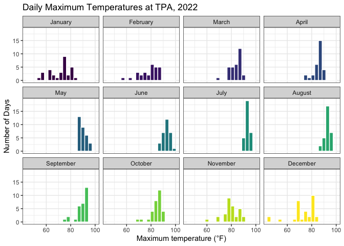
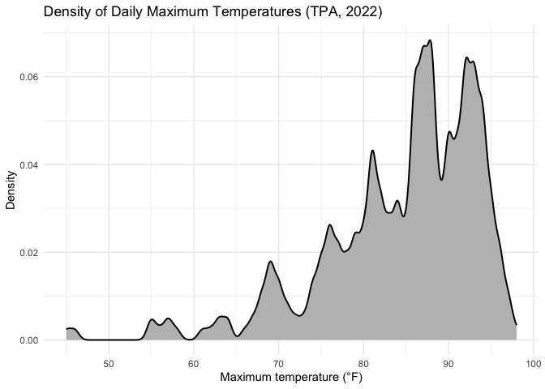
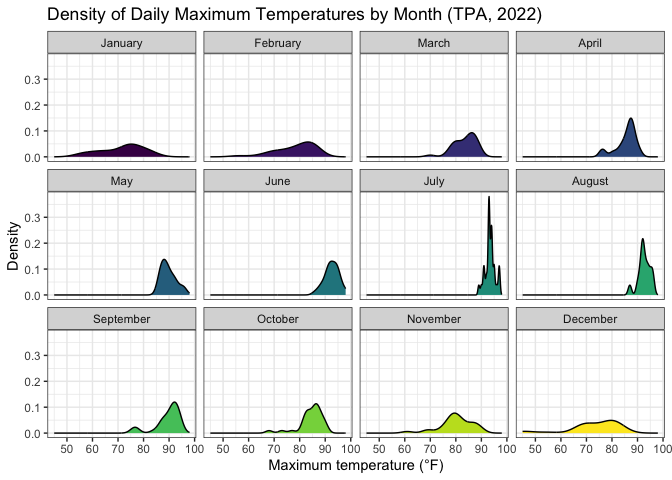
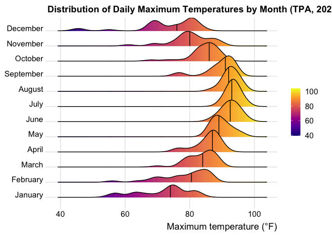
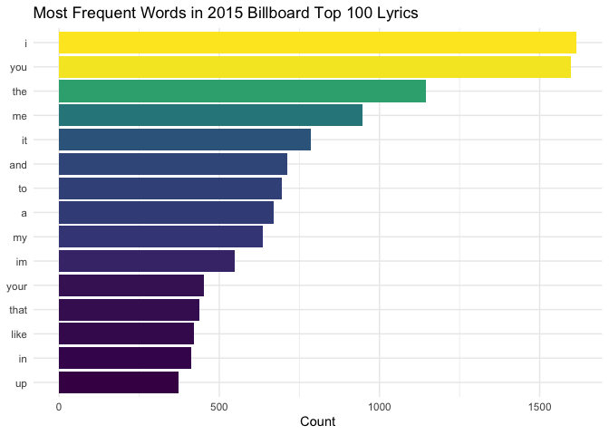
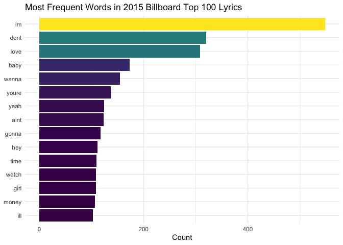
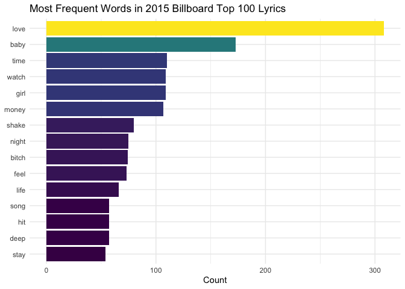

# Setup


``` r
library(tidyverse)
#install.packages("plotly")
library(plotly)
```

# PART 1: Density Plots


``` r
weather_tpa <- read_csv("../data/tpa_weather_2022.csv") %>%
  mutate(month_name = factor(month.name[month], levels = month.name))
```

## (a) Faceted Histogram of Max Temperatures

A facet wrap histogram (using `binwidth = 3`) of count of days each month having 
a maximum temperature.


``` r
weather_tpa %>% 
  ggplot(aes(max_temp, fill = month_name)) +
  geom_histogram(binwidth = 3, color = "white") +
  facet_wrap(~ month_name) +
  scale_fill_viridis_d(option = "viridis") +
  labs(title = "Daily Maximum Temperatures at TPA, 2022",
       x = "Maximum temperature (°F)", 
       y = "Number of Days") +
  theme_bw() +
  theme(legend.position = "none")
```




## (b) Density of Max Temperatures

A density plot, without grouping by month.


``` r
weather_tpa %>% 
  ggplot(aes(max_temp)) +
  geom_density(bw = 0.5, linewidth = 0.7, fill = "grey") +
  labs(title = "Density of Daily Maximum Temperatures (TPA, 2022)",
       x = "Maximum temperature (°F)", 
       y = "Density") +
  theme_minimal()
```



## (c) Faceted Density of Max Temperatures

Another facet wrap, this time using density plots.


``` r
weather_tpa %>% 
  ggplot(aes(max_temp, fill = month_name)) +
  geom_density() +
  facet_wrap(~ month_name) +
  scale_fill_viridis_d() +
  labs(
    title = "Density of Daily Maximum Temperatures by Month (TPA, 2022)",
    x = "Maximum temperature (°F)", 
    y = "Density") +
  theme_bw() +
  theme(legend.position = "none")
```



## (d) Ridgeline Plot with Median Lines

Using the `{ggridges}` package and the `geom_density_ridges()` function with 
close attention to the `quantile_lines` and `quantiles` parameters. The plot 
below uses the `plasma` option (color scale) for the `viridis` palette.


``` r
library(ggridges)
weather_tpa %>% 
  ggplot(aes(
    x = max_temp,
    y = month_name,
    fill = after_stat(x))) +
  geom_density_ridges_gradient(
    quantile_lines = TRUE, 
    quantiles = 2) +
  scale_fill_viridis_c(option = "plasma") +
  labs(
    title = "Distribution of Daily Maximum Temperatures by Month (TPA, 2022)",
    x = "Maximum temperature (°F)",
    y = NULL, fill = NULL) +
  theme_ridges()
```



## (e) Precipitation (Interactive)

Total monthly precipitation as a column chart; as noted, values of -99.9 for 
temperature or -99.99 for precipitation represent missing data. The interactivity 
of this chart adds granularity without clutter: users can hover over each bar to 
see the exact total inches of precipitation that month. Without the interactivity 
this granularity would require labeling the individual bars with their 
precipitation values.


``` r
precip_plot <- weather_tpa %>%
  filter(precipitation >= 0) %>%
  group_by(month_name) %>%
  summarise(total_precip = sum(precipitation), .groups = "drop") %>% 
  ggplot(aes(month_name, total_precip, fill = total_precip)) +
  geom_col() +
  scale_fill_viridis_c(option = "viridis") +
  labs(title = "Total Monthly Precipitation at TPA, 2022",
       x = NULL, y = "Total precipitation (inches)", fill = "Inches") +
  theme_minimal() +
  theme(axis.text.x = element_text(angle = 45, hjust = 1))

ggplotly(precip_plot)
```

```{=html}
<div class="plotly html-widget html-fill-item" id="htmlwidget-719dffc3faed2ea870d9" style="width:672px;height:480px;"></div>
<script type="application/json" data-for="htmlwidget-719dffc3faed2ea870d9">{"x":{"data":[{"orientation":"v","width":0.90000000000000013,"base":0,"x":[2],"y":[0.62002000000000002],"text":"month_name: February<br />total_precip:  0.62002<br />total_precip:  0.62002","type":"bar","textposition":"none","marker":{"autocolorscale":false,"color":"rgba(68,1,84,1)","line":{"width":1.8897637795275593,"color":"transparent"}},"showlegend":false,"xaxis":"x","yaxis":"y","hoverinfo":"text","frame":null},{"orientation":"v","width":0.89999999999999858,"base":0,"x":[10],"y":[1.1000299999999998],"text":"month_name: October<br />total_precip:  1.10003<br />total_precip:  1.10003","type":"bar","textposition":"none","marker":{"autocolorscale":false,"color":"rgba(69,21,94,1)","line":{"width":1.8897637795275593,"color":"transparent"}},"showlegend":false,"xaxis":"x","yaxis":"y","hoverinfo":"text","frame":null},{"orientation":"v","width":0.89999999999999991,"base":0,"x":[1],"y":[1.4600400000000002],"text":"month_name: January<br />total_precip:  1.46004<br />total_precip:  1.46004","type":"bar","textposition":"none","marker":{"autocolorscale":false,"color":"rgba(70,31,102,1)","line":{"width":1.8897637795275593,"color":"transparent"}},"showlegend":false,"xaxis":"x","yaxis":"y","hoverinfo":"text","frame":null},{"orientation":"v","width":0.89999999999999858,"base":0,"x":[12],"y":[2.3500100000000002],"text":"month_name: December<br />total_precip:  2.35001<br />total_precip:  2.35001","type":"bar","textposition":"none","marker":{"autocolorscale":false,"color":"rgba(68,54,121,1)","line":{"width":1.8897637795275593,"color":"transparent"}},"showlegend":false,"xaxis":"x","yaxis":"y","hoverinfo":"text","frame":null},{"orientation":"v","width":0.90000000000000036,"base":0,"x":[5],"y":[2.7100200000000001],"text":"month_name: May<br />total_precip:  2.71002<br />total_precip:  2.71002","type":"bar","textposition":"none","marker":{"autocolorscale":false,"color":"rgba(67,62,129,1)","line":{"width":1.8897637795275593,"color":"transparent"}},"showlegend":false,"xaxis":"x","yaxis":"y","hoverinfo":"text","frame":null},{"orientation":"v","width":0.90000000000000036,"base":0,"x":[3],"y":[2.9100200000000003],"text":"month_name: March<br />total_precip:  2.91002<br />total_precip:  2.91002","type":"bar","textposition":"none","marker":{"autocolorscale":false,"color":"rgba(65,67,134,1)","line":{"width":1.8897637795275593,"color":"transparent"}},"showlegend":false,"xaxis":"x","yaxis":"y","hoverinfo":"text","frame":null},{"orientation":"v","width":0.89999999999999858,"base":0,"x":[11],"y":[5.1800399999999973],"text":"month_name: November<br />total_precip:  5.18004<br />total_precip:  5.18004","type":"bar","textposition":"none","marker":{"autocolorscale":false,"color":"rgba(44,118,142,1)","line":{"width":1.8897637795275593,"color":"transparent"}},"showlegend":false,"xaxis":"x","yaxis":"y","hoverinfo":"text","frame":null},{"orientation":"v","width":0.89999999999999947,"base":0,"x":[8],"y":[6.5100499999999988],"text":"month_name: August<br />total_precip:  6.51005<br />total_precip:  6.51005","type":"bar","textposition":"none","marker":{"autocolorscale":false,"color":"rgba(43,145,137,1)","line":{"width":1.8897637795275593,"color":"transparent"}},"showlegend":false,"xaxis":"x","yaxis":"y","hoverinfo":"text","frame":null},{"orientation":"v","width":0.90000000000000036,"base":0,"x":[4],"y":[6.7599999999999998],"text":"month_name: April<br />total_precip:  6.76000<br />total_precip:  6.76000","type":"bar","textposition":"none","marker":{"autocolorscale":false,"color":"rgba(42,150,136,1)","line":{"width":1.8897637795275593,"color":"transparent"}},"showlegend":false,"xaxis":"x","yaxis":"y","hoverinfo":"text","frame":null},{"orientation":"v","width":0.90000000000000036,"base":0,"x":[6],"y":[8.0700300000000009],"text":"month_name: June<br />total_precip:  8.07003<br />total_precip:  8.07003","type":"bar","textposition":"none","marker":{"autocolorscale":false,"color":"rgba(62,176,124,1)","line":{"width":1.8897637795275593,"color":"transparent"}},"showlegend":false,"xaxis":"x","yaxis":"y","hoverinfo":"text","frame":null},{"orientation":"v","width":0.90000000000000036,"base":0,"x":[7],"y":[11.990029999999997],"text":"month_name: July<br />total_precip: 11.99003<br />total_precip: 11.99003","type":"bar","textposition":"none","marker":{"autocolorscale":false,"color":"rgba(238,229,46,1)","line":{"width":1.8897637795275593,"color":"transparent"}},"showlegend":false,"xaxis":"x","yaxis":"y","hoverinfo":"text","frame":null},{"orientation":"v","width":0.89999999999999858,"base":0,"x":[9],"y":[12.29002],"text":"month_name: September<br />total_precip: 12.29002<br />total_precip: 12.29002","type":"bar","textposition":"none","marker":{"autocolorscale":false,"color":"rgba(253,231,37,1)","line":{"width":1.8897637795275593,"color":"transparent"}},"showlegend":false,"xaxis":"x","yaxis":"y","hoverinfo":"text","frame":null},{"x":[1],"y":[0],"name":"e86427ef97b08fb7cbccca434c451fc8","type":"scatter","mode":"markers","opacity":0,"hoverinfo":"skip","showlegend":false,"marker":{"color":[0,1],"colorscale":[[0,"#440154"],[0.0033444816053511744,"#440355"],[0.0066889632107023393,"#440456"],[0.010033444816053514,"#440656"],[0.013377926421404679,"#450857"],[0.016722408026755852,"#450958"],[0.020066889632107027,"#450B59"],[0.023411371237458199,"#450D5A"],[0.026755852842809364,"#450E5B"],[0.030100334448160529,"#45105B"],[0.033444816053511704,"#45115C"],[0.03678929765886288,"#45135D"],[0.040133779264214055,"#45145E"],[0.043478260869565209,"#45155F"],[0.046822742474916385,"#451760"],[0.05016722408026756,"#451860"],[0.053511705685618728,"#451961"],[0.056856187290969903,"#461A62"],[0.060200668896321079,"#461B63"],[0.063545150501672254,"#461D64"],[0.066889632107023408,"#461E65"],[0.070234113712374577,"#461F65"],[0.073578595317725759,"#462066"],[0.076923076923076913,"#462167"],[0.080267558528428082,"#462268"],[0.083612040133779264,"#462369"],[0.086956521739130432,"#46246A"],[0.090301003344481615,"#46256B"],[0.093645484949832783,"#46266B"],[0.096989966555183965,"#46276C"],[0.10033444816053512,"#46286D"],[0.10367892976588629,"#46296E"],[0.10702341137123746,"#462A6F"],[0.11036789297658864,"#452B70"],[0.11371237458193981,"#452C70"],[0.11705685618729096,"#452D71"],[0.12040133779264214,"#452E72"],[0.12374581939799331,"#452F73"],[0.12709030100334448,"#453074"],[0.13043478260869568,"#453175"],[0.13377926421404684,"#453276"],[0.13712374581939799,"#453377"],[0.14046822742474918,"#453477"],[0.14381270903010032,"#443578"],[0.14715719063545155,"#443679"],[0.15050167224080266,"#44367A"],[0.15384615384615385,"#44377B"],[0.15719063545150502,"#44387C"],[0.16053511705685619,"#44397D"],[0.16387959866220736,"#443A7D"],[0.16722408026755853,"#433B7E"],[0.17056856187290972,"#433C7F"],[0.17391304347826084,"#433D80"],[0.17725752508361203,"#433E81"],[0.18060200668896317,"#433F82"],[0.1839464882943144,"#424083"],[0.18729096989966554,"#424184"],[0.19063545150501673,"#424185"],[0.19397993311036787,"#424285"],[0.19732441471571902,"#414386"],[0.20066889632107024,"#414487"],[0.20401337792642135,"#414587"],[0.20735785953177258,"#414687"],[0.21070234113712372,"#414787"],[0.21404682274247491,"#414888"],[0.21739130434782605,"#404988"],[0.22073578595317728,"#404A88"],[0.22408026755852842,"#404A88"],[0.22742474916387961,"#404B88"],[0.23076923076923075,"#404C88"],[0.23411371237458189,"#404D88"],[0.23745819397993312,"#404E88"],[0.24080267558528423,"#3F4F89"],[0.24414715719063546,"#3F5089"],[0.2474916387959866,"#3F5189"],[0.25083612040133779,"#3F5289"],[0.25418060200668896,"#3F5289"],[0.25752508361204013,"#3E5389"],[0.2608695652173913,"#3E5489"],[0.26421404682274252,"#3E5589"],[0.26755852842809363,"#3E568A"],[0.27090301003344475,"#3D578A"],[0.27424749163879597,"#3D588A"],[0.27759197324414714,"#3D598A"],[0.28093645484949831,"#3D598A"],[0.28428093645484948,"#3C5A8A"],[0.2876254180602007,"#3C5B8A"],[0.29096989966555181,"#3C5C8A"],[0.29431438127090304,"#3B5D8A"],[0.29765886287625415,"#3B5E8B"],[0.30100334448160537,"#3B5F8B"],[0.30434782608695654,"#3A5F8B"],[0.30769230769230765,"#3A608B"],[0.31103678929765888,"#3A618B"],[0.31438127090300999,"#39628B"],[0.31772575250836121,"#39638B"],[0.32107023411371233,"#38648B"],[0.32441471571906355,"#38658C"],[0.32775919732441472,"#38658C"],[0.33110367892976589,"#37668C"],[0.33444816053511706,"#37678C"],[0.33779264214046828,"#36688C"],[0.34113712374581939,"#36698C"],[0.34448160535117062,"#356A8C"],[0.34782608695652173,"#356B8C"],[0.35117056856187295,"#346B8C"],[0.35451505016722407,"#346C8D"],[0.35785953177257523,"#336D8D"],[0.36120401337792646,"#326E8D"],[0.36454849498327757,"#326F8D"],[0.3678929765886288,"#31708D"],[0.37123745819397991,"#31718D"],[0.37458193979933113,"#30718D"],[0.3779264214046823,"#2F728D"],[0.38127090301003347,"#2F738D"],[0.38461538461538464,"#2E748E"],[0.38795986622073586,"#2D758E"],[0.39130434782608697,"#2C768E"],[0.39464882943143809,"#2B778E"],[0.39799331103678931,"#2B778E"],[0.40133779264214048,"#2A788E"],[0.40468227424749165,"#2A798E"],[0.40802675585284282,"#2A7A8E"],[0.41137123745819404,"#2B7B8E"],[0.41471571906354515,"#2B7B8D"],[0.41806020066889638,"#2B7C8D"],[0.42140468227424749,"#2B7D8D"],[0.42474916387959871,"#2B7E8D"],[0.42809364548494983,"#2B7F8D"],[0.43143812709030099,"#2B7F8D"],[0.43478260869565222,"#2B808D"],[0.43812709030100333,"#2B818C"],[0.44147157190635455,"#2B828C"],[0.44481605351170567,"#2B838C"],[0.44816053511705689,"#2C838C"],[0.451505016722408,"#2C848C"],[0.45484949832775923,"#2C858C"],[0.4581939799331104,"#2C868B"],[0.46153846153846156,"#2C878B"],[0.46488294314381273,"#2C878B"],[0.46822742474916385,"#2C888B"],[0.47157190635451507,"#2C898B"],[0.47491638795986624,"#2C8A8B"],[0.47826086956521741,"#2C8B8B"],[0.48160535117056857,"#2B8B8A"],[0.4849498327759198,"#2B8C8A"],[0.48829431438127091,"#2B8D8A"],[0.49163879598662213,"#2B8E8A"],[0.49498327759197325,"#2B8F8A"],[0.49832775919732447,"#2B8F8A"],[0.50167224080267558,"#2B9089"],[0.50501672240802675,"#2B9189"],[0.50836120401337792,"#2B9289"],[0.51170568561872909,"#2B9389"],[0.51505016722408026,"#2A9389"],[0.51839464882943143,"#2A9489"],[0.52173913043478271,"#2A9588"],[0.52508361204013376,"#2A9688"],[0.52842809364548504,"#2A9788"],[0.5317725752508361,"#2A9788"],[0.53511705685618727,"#299888"],[0.53846153846153844,"#299987"],[0.5418060200668896,"#299A87"],[0.54515050167224088,"#299B87"],[0.54849498327759194,"#289B87"],[0.55183946488294322,"#289C87"],[0.55518394648829428,"#289D87"],[0.55852842809364556,"#279E86"],[0.56187290969899661,"#279F86"],[0.56521739130434789,"#27A086"],[0.56856187290969906,"#26A086"],[0.57190635451505012,"#26A186"],[0.5752508361204014,"#26A285"],[0.57859531772575246,"#25A385"],[0.58193979933110374,"#25A485"],[0.5852842809364549,"#24A485"],[0.58862876254180607,"#24A585"],[0.59197324414715724,"#23A684"],[0.59531772575250841,"#23A784"],[0.59866220735785958,"#22A884"],[0.60200668896321075,"#24A884"],[0.60535117056856191,"#27A983"],[0.60869565217391308,"#2AAA82"],[0.61204013377926425,"#2DAA81"],[0.61538461538461542,"#2FAB81"],[0.61872909698996659,"#32AC80"],[0.62207357859531776,"#34AC7F"],[0.62541806020066892,"#36AD7E"],[0.62876254180602009,"#38AE7E"],[0.63210702341137126,"#3AAE7D"],[0.63545150501672243,"#3CAF7C"],[0.6387959866220736,"#3EB07B"],[0.64214046822742465,"#40B07B"],[0.64548494983277593,"#42B17A"],[0.6488294314381271,"#43B279"],[0.65217391304347816,"#45B278"],[0.65551839464882944,"#47B378"],[0.65886287625418061,"#48B477"],[0.66220735785953178,"#4AB476"],[0.66555183946488283,"#4BB575"],[0.66889632107023411,"#4DB675"],[0.67224080267558528,"#4EB674"],[0.67558528428093656,"#50B773"],[0.67892976588628762,"#51B872"],[0.68227424749163879,"#53B971"],[0.68561872909698995,"#54B971"],[0.68896321070234123,"#55BA70"],[0.69230769230769229,"#57BB6F"],[0.69565217391304346,"#58BB6E"],[0.69899665551839474,"#59BC6D"],[0.70234113712374591,"#5BBD6C"],[0.70568561872909696,"#5CBD6C"],[0.70903010033444813,"#5DBE6B"],[0.71237458193979941,"#5EBF6A"],[0.71571906354515047,"#5FBF69"],[0.71906354515050164,"#61C068"],[0.72240802675585292,"#62C167"],[0.72575250836120409,"#63C166"],[0.72909698996655514,"#64C266"],[0.73244147157190631,"#65C365"],[0.73578595317725759,"#66C464"],[0.73913043478260876,"#67C463"],[0.74247491638795982,"#69C562"],[0.7458193979933111,"#6AC661"],[0.74916387959866226,"#6BC660"],[0.75250836120401332,"#6CC75F"],[0.7558528428093646,"#6DC85E"],[0.75919732441471577,"#6EC85D"],[0.76254180602006694,"#6FC95C"],[0.76588628762541799,"#70CA5B"],[0.76923076923076927,"#71CB5A"],[0.77257525083612044,"#72CB59"],[0.77591973244147172,"#73CC58"],[0.77926421404682278,"#74CD57"],[0.78260869565217395,"#75CD56"],[0.78595317725752512,"#76CE55"],[0.78929765886287617,"#77CF54"],[0.79264214046822745,"#78CF53"],[0.79598662207357862,"#79D052"],[0.7993311036789299,"#7AD151"],[0.80267558528428096,"#7CD151"],[0.80602006688963213,"#7FD250"],[0.80936454849498329,"#81D250"],[0.81270903010033457,"#84D34F"],[0.81605351170568563,"#87D34F"],[0.8193979933110368,"#89D34E"],[0.82274247491638808,"#8CD44D"],[0.82608695652173914,"#8ED44D"],[0.8294314381270903,"#91D54C"],[0.83277591973244147,"#93D54C"],[0.83612040133779275,"#95D54B"],[0.83946488294314381,"#98D64B"],[0.84280936454849498,"#9AD64A"],[0.84615384615384626,"#9DD74A"],[0.84949832775919742,"#9FD749"],[0.85284280936454848,"#A1D748"],[0.85618729096989965,"#A3D848"],[0.85953177257525093,"#A6D847"],[0.86287625418060199,"#A8D947"],[0.86622073578595316,"#AAD946"],[0.86956521739130443,"#ACD946"],[0.8729096989966556,"#AFDA45"],[0.87625418060200666,"#B1DA44"],[0.87959866220735783,"#B3DB44"],[0.88294314381270911,"#B5DB43"],[0.88628762541806028,"#B7DB42"],[0.88963210702341133,"#BADC42"],[0.89297658862876261,"#BCDC41"],[0.89632107023411378,"#BEDC40"],[0.89966555183946484,"#C0DD40"],[0.90301003344481601,"#C2DD3F"],[0.90635451505016729,"#C4DE3E"],[0.90969899665551845,"#C6DE3E"],[0.91304347826086951,"#C8DE3D"],[0.91638795986622079,"#CBDF3C"],[0.91973244147157196,"#CDDF3B"],[0.92307692307692313,"#CFDF3B"],[0.9264214046822743,"#D1E03A"],[0.92976588628762546,"#D3E039"],[0.93311036789297663,"#D5E038"],[0.93645484949832769,"#D7E138"],[0.93979933110367897,"#D9E137"],[0.94314381270903014,"#DBE136"],[0.94648829431438142,"#DDE235"],[0.94983277591973247,"#DFE234"],[0.95317725752508364,"#E1E233"],[0.95652173913043481,"#E3E333"],[0.95986622073578609,"#E5E332"],[0.96321070234113715,"#E7E331"],[0.96655518394648832,"#E9E430"],[0.9698996655518396,"#EBE42F"],[0.97324414715719065,"#EDE42E"],[0.97658862876254182,"#EFE52D"],[0.97993311036789299,"#F1E52C"],[0.98327759197324427,"#F3E52B"],[0.98662207357859533,"#F5E62A"],[0.98996655518394649,"#F7E629"],[0.99331103678929777,"#F9E627"],[0.99665551839464894,"#FBE726"],[1,"#FDE725"]],"colorbar":{"bgcolor":null,"bordercolor":null,"borderwidth":0,"thickness":23.039999999999996,"title":"Inches","titlefont":{"color":"rgba(0,0,0,1)","family":"","size":14.611872146118724},"tickmode":"array","ticktext":["3","6","9","12"],"tickvals":[0.20492688374750068,0.46113939445872598,0.7173519051699514,0.97356441588117681],"tickfont":{"color":"rgba(0,0,0,1)","family":"","size":11.68949771689498},"ticklen":2,"len":0.5}},"xaxis":"x","yaxis":"y","frame":null}],"layout":{"margin":{"t":40.840182648401829,"r":7.3059360730593621,"b":39.266363793525933,"l":48.949771689497723},"paper_bgcolor":"rgba(255,255,255,1)","font":{"color":"rgba(0,0,0,1)","family":"","size":14.611872146118724},"title":{"text":"Total Monthly Precipitation at TPA, 2022","font":{"color":"rgba(0,0,0,1)","family":"","size":17.534246575342465},"x":0,"xref":"paper"},"xaxis":{"domain":[0,1],"automargin":true,"type":"linear","autorange":false,"range":[0.40000000000000002,12.6],"tickmode":"array","ticktext":["January","February","March","April","May","June","July","August","September","October","November","December"],"tickvals":[1,2,3,4.0000000000000009,5,6,7.0000000000000009,8,9,10,11,12],"categoryorder":"array","categoryarray":["January","February","March","April","May","June","July","August","September","October","November","December"],"nticks":null,"ticks":"","tickcolor":null,"ticklen":3.6529680365296811,"tickwidth":0,"showticklabels":true,"tickfont":{"color":"rgba(77,77,77,1)","family":"","size":11.68949771689498},"tickangle":-45,"showline":false,"linecolor":null,"linewidth":0,"showgrid":true,"gridcolor":"rgba(235,235,235,1)","gridwidth":0.66417600664176002,"zeroline":false,"anchor":"y","title":{"text":"","font":{"color":"rgba(0,0,0,1)","family":"","size":14.611872146118724}},"hoverformat":".2f"},"yaxis":{"domain":[0,1],"automargin":true,"type":"linear","autorange":false,"range":[-0.61450100000000007,12.904521000000001],"tickmode":"array","ticktext":["0.0","2.5","5.0","7.5","10.0","12.5"],"tickvals":[0,2.5,5,7.5000000000000009,10,12.5],"categoryorder":"array","categoryarray":["0.0","2.5","5.0","7.5","10.0","12.5"],"nticks":null,"ticks":"","tickcolor":null,"ticklen":3.6529680365296811,"tickwidth":0,"showticklabels":true,"tickfont":{"color":"rgba(77,77,77,1)","family":"","size":11.68949771689498},"tickangle":-0,"showline":false,"linecolor":null,"linewidth":0,"showgrid":true,"gridcolor":"rgba(235,235,235,1)","gridwidth":0.66417600664176002,"zeroline":false,"anchor":"x","title":{"text":"Total precipitation (inches)","font":{"color":"rgba(0,0,0,1)","family":"","size":14.611872146118724}},"hoverformat":".2f"},"shapes":[],"showlegend":false,"legend":{"bgcolor":null,"bordercolor":null,"borderwidth":0,"font":{"color":"rgba(0,0,0,1)","family":"","size":11.68949771689498},"title":{"text":"Inches","font":{"color":"rgba(0,0,0,1)","family":"","size":14.611872146118724}}},"hovermode":"closest","barmode":"relative"},"config":{"doubleClick":"reset","modeBarButtonsToAdd":["hoverclosest","hovercompare"],"showSendToCloud":false},"source":"A","attrs":{"ab1b6b18200f":{"x":{},"y":{},"fill":{},"type":"bar"}},"cur_data":"ab1b6b18200f","visdat":{"ab1b6b18200f":["function (y) ","x"]},"highlight":{"on":"plotly_click","persistent":false,"dynamic":false,"selectize":false,"opacityDim":0.20000000000000001,"selected":{"opacity":1},"debounce":0},"shinyEvents":["plotly_hover","plotly_click","plotly_selected","plotly_relayout","plotly_brushed","plotly_brushing","plotly_clickannotation","plotly_doubleclick","plotly_deselect","plotly_afterplot","plotly_sunburstclick"],"base_url":"https://plot.ly"},"evals":[],"jsHooks":[]}</script>
```

``` r
htmlwidgets::saveWidget(ggplotly(precip_plot),"interactive_precip_plot.html", selfcontained = TRUE)
```

# PART 2: Visualizing Text Data — Billboard Top 100 Lyrics (2015)

I chose the **Billboard Top 100** lyrics for 2015 because I wanted to work with 
a music dataset. Each row is a charting song with its rank, artist, and full lyrics.

For text analysis, I brought in the 
[`tidytext`](https://cran.r-project.org/web/packages/tidytext/index.html) package 
for parsing the song lyrics.


``` r
library(tidytext)
bb <- read_csv("../data/BB_top100_2015.csv")
```

## Most Frequent Words

I started by using the `unnest_tokens` function from `tidytext` to tokenize the 
lyrics so that I could count the tokens. 


``` r
bb %>% 
  unnest_tokens(word, Lyrics) %>%
  count(word, sort = TRUE) %>%
  slice_max(n, n = 15) %>%
  mutate(word = fct_reorder(word, n)) %>%
  ggplot(aes(n, word, fill = n)) +
  geom_col() +
  scale_fill_viridis_c() +
  labs(
    title = "Most Frequent Words in 2015 Billboard Top 100 Lyrics",
    x = "Count", 
    y = NULL) +
  theme_minimal() +
  theme(legend.position = "none")
```



Not so interesting, this more seems like a list of most frequent general English 
words. `tidytext` also includes a `stop_words` dataset that can help filter 
these out with anti-join.


``` r
bb %>% 
  unnest_tokens(word, Lyrics) %>%
  anti_join(stop_words, by = "word") %>% 
  count(word, sort = TRUE) %>%
  slice_max(n, n = 15) %>%
  mutate(word = fct_reorder(word, n)) %>%
  ggplot(aes(n, word, fill = n)) +
  geom_col() +
  scale_fill_viridis_c() +
  labs(
    title = "Most Frequent Words in 2015 Billboard Top 100 Lyrics",
    x = "Count", 
    y = NULL) +
  theme_minimal() +
  theme(legend.position = "none")
```



A little more interesting, but we still have variants of stop words included 
among the content. Let's create a custom list to filter those out too.


``` r
custom_stops <- tibble(word = c(
  "im", "dont", "youre", "ive", "cant", "wont", "didnt", "aint", "ill", "id",
  "thats", "its", "hes", "shes", "theyre", "gotta", "gonna", "wanna",
  "yeah", "oh", "na", "la", "uh", "ooh", "woah", "whoa", "hey", "mmm",
  "yo", "ya", "em", "ck", "bout"))

bb %>% 
  unnest_tokens(word, Lyrics) %>%
  anti_join(stop_words, by = "word") %>% 
  anti_join(custom_stops, by = "word") %>% 
  count(word, sort = TRUE) %>%
  slice_max(n, n = 15) %>%
  mutate(word = fct_reorder(word, n)) %>%
  ggplot(aes(n, word, fill = n)) +
  geom_col() +
  scale_fill_viridis_c() +
  labs(
    title = "Most Frequent Words in 2015 Billboard Top 100 Lyrics",
    x = "Count", 
    y = NULL) +
  theme_minimal() +
  theme(legend.position = "none")
```



``` r
ggsave("../figures/project-03-billboard-most-frequent.png", width = 8, height = 5, dpi = 150)
```

This graph gives us a much clearer picture of the most common content words in 
the lyrics, with **love** as the recurring most common, followed by baby, time, 
girl, and money, reflecting the themes of mainstream pop and hip-hop.


``` r
bb %>% 
  unnest_tokens(word, Lyrics) %>%
  anti_join(stop_words, by = "word") %>% 
  anti_join(custom_stops, by = "word") %>% 
  summarise(
    total_words = n(), 
    total_distinct_words = n_distinct(word))
```

```
## # A tibble: 1 × 2
##   total_words total_distinct_words
##         <int>                <int>
## 1       12415                 3268
```

## Redesigning a Bad Chart (Before/After)

The **Most Frequent Words** charts above also demonstrate a before/after chart 
redesign. Initially the data shown in the chart was not particularly useful for 
the story the data was trying to tell: the most common content of song lyrics. 
But with some data exploration and refinement, the final chart provides a much 
more interesting picture of the commonality of hip hop love songs, with minimal 
changes to the chart itself required.
